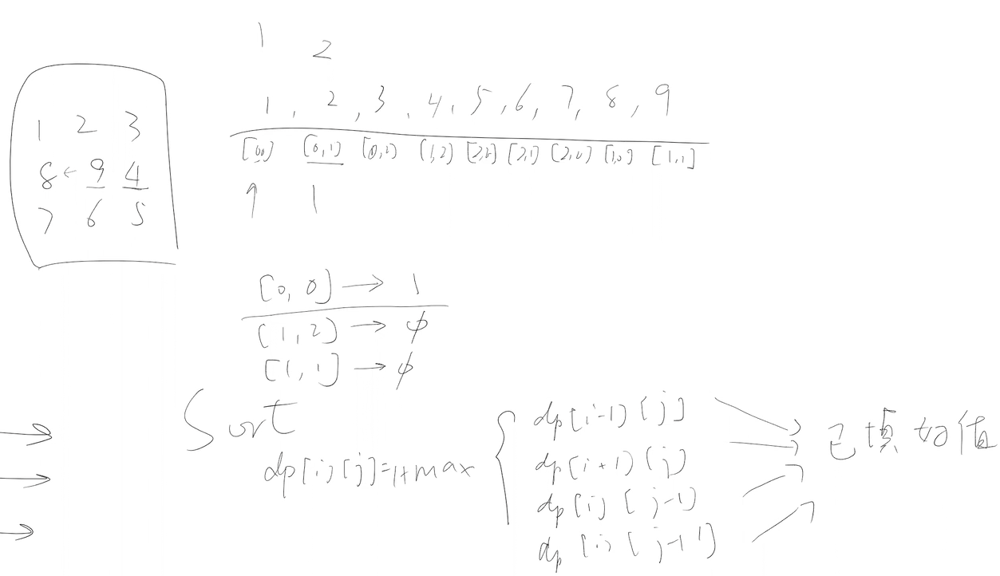

## Pruning
1. dfs避免重复计算
2. 是否可以pruning？
   - 能否找到一个数据结构表示并记忆重复的内容？
   - key：搜索状态，e.g. index, String才可以pruning，而array[] array[][] 或者hashmap可能不行
   - value：dfs返回值 boolean，int可以pruning，而void（all possible solution)不行
3. 常用pruning：int[], int[][], boolean[], boolean[][], hashmap<String, in / boolean>
4. dfs + pruning有些可以直接转dp，有些不行，例如：
   - 不是index，不好顺序填值，像是string
   - 离散的搜索状态时使用hashmap （L403)
   - 没有顺序填值（L329)
5. 时间复杂度：dfs+ pruning 等价于dp的level
## L139
1. Notes
   - null
2. Follow up
   - null
### S1
1. Ideas：
   - dfs + boolean[] 计划存储
   - worst case：s：aaaaa...aaaab，dict: a, aa, aaa, ..., aa...a
   - 时间复杂度：每次dfs n，一共call n层，所以是n^2
2. Code
```java
class Solution {
    public int solution(int[] nums) {
        
    }
    private boolean dfs(String s, int idx, HashSet<String> dict， Boolean[] mem) {
        if (idx == s.length()) {
            return true;
        }
        if (mem[idx] != null) return mem[idx];

        for (int i = idx; i < s.length(); i++) {
            String str = s.subString(idx, i);
            if (dict.contains(str)) {
                if (dfs(s, i, dict)) {
                    mem[idx] = true;
                    return true;
                }
            }
        }
        mem[idx] = false;
        return false;
    }
}
```
## L10
1. Notes
   - null
2. Follow up
   - null
### S1
1. Ideas：
   - dfs
   - 只因为*分叉
   - 注意*和空的匹配
   - 时间复杂度：
     - worst case：aaa...aab, a*a*a* ... a*
     - 有pruning：mem的size乘以填每个位置的cost = mn * m
     - 可以dp
2. Code
```java
class Solution {
    public int solution(int[] nums) {
        
    }
    private boolean dfs(String s, int idxS, String p, int idxP) {
        int lenS = s.length();
        int lenP = p.length();

        if (idxP == p.length()) {
            return idxS == s.length();
        }

        if (idxP + 1 == lenP || p[idxP + 1] != '*') { // not *
            if (idxS < lenS && isMatched(s, idxS, p, idxP)) {
                return dfs(s, idxS + 1, p, idxP + 1);
            } else {
                return false;
            }
        } else { // is *
            int i = idxS - 1; // handle a* = 空的情况，注意下面while loop的i < idxS，避免了越界
            while (i < lenS && (i < idxS || isMatched(s, i, p, idxP))) {
                if (dfs(s, i + 1, p, idxP + 2)) {
                    return true;
                }
                i++;
            }
            return false;
        }
    }
}
```
pruning:
```java
class Solution {
    public int solution(int[] nums) {
        
    }
    private boolean dfs(String s, int idxS, String p, int idxP, Boolean[][] mem) {
        int lenS = s.length();
        int lenP = p.length();

        if (idxP == p.length()) {
            return idxS == s.length();
        }
        if (mem[idxS][idxP] != null) return mem[idxS][idxP];

        if (idxP + 1 == lenP || p[idxP + 1] != '*') { // not *
            if (idxS < lenS && isMatched(s, idxS, p, idxP)) {
                mem[idxS][idxP] = dfs(s, idxS + 1, p, idxP + 1);
                return mem[idxS][idxP];
            } else {
                mem[idxS][idxP] = false;
                return false;
            }
        } else { // is *
            int i = idxS - 1; // handle a* = 空的情况，注意下面while loop的i < idxS，避免了越界
            while (i < lenS && (i < idxS || isMatched(s, i, p, idxP))) {
                if (dfs(s, i + 1, p, idxP + 2)) {
                    mem[idxS][idxP] = true;
                    return true;
                }
                i++;
            }
            mem[idxS][idxP] = false;
            return false;
        }
    }
}
```
## L140
1. Notes
   - null
2. Follow up
   - null
### S1
1. Ideas：
   - dp + 反向记录路径 + dfs所有路径
2. Code
```java
class Solution {
    public List<String> wordBreakII(String s, HashSet<String> dict) {
        int len = s.length();
        Boolean[] dp = new Boolean[len + 1];
        dp[len] = true;
        
        HashMap<Intger, List<Integer>> graph = new HashMap<>();

        for (int i = len - 1; i >= 0; i--) {
            dp[i] = false;
            for (int j = i + 1; j < len; j++) {
                String str = s.subString(i, j+1);
                if (dict.contains(str) && dp[j+1]) {
                    dp[i] = true;
                    List<Integer> curs = graph.get(j+1);
                    if (curs == null) {
                        graph.put(j+1, new ArrayList<String>());
                    }
                    graph.get(j+1).add(i);
                }
            }
        }
        List<String> res = new List<>();
        dfs(res, s, new StringBuilder(), s.length(), graph);
        return res;
    }
    private void dfs(List<String> res, String s, StringBuilder path, int idx, HashMap<Integer, List<Integer>> graph) {
        if (idx == 0) {
            res.add(convert(path));
            return;
        }
        int pathLen = path.length();
        for (next: grpah.get(idx)) {
            path.append(s.subString(next, idx)+ " ");
            dfs(res, path, next, graph);
            path.setLength(pathLen);
        }
    }
}
```
### S2
1. Ideas：
   - dfs + pruning
   - 这里word break 可以做剪枝，因为只要break到底就是一个solution。而在word ladder II是求所有最短路径，也就是说跑到底了不是最短的也不要，不能剪枝
## L403
1. Notes
   - null
2. Follow up
   - null
### S1
1. Ideas：
   - dfs
   - pruning，离散状态，使用hashmap。如果使用2d array，由于离散，空间很浪费
   - dp? 不合适，hashmap很难实现；如果是2d array，可以，但是依旧浪费空间
   - 时间复杂度：n*k，每次填表，for loop amortizing到nk的任一位置
2. Code
```java
class Solution {
    public boolean solution(int[] stones) {
        
    }

    private boolean dfs(int[] stones, int idx, int k, HashMap<Integer, Boolean>[] mem) {
        int len = stones.length();
        if (idx == len - 1) {
            return true;
        }
        HashMap<Integer, Boolean> map = mem[idx];
        Boolean ret = map.get(k);
        if (ret != null) return ret;


        for (int i = idx + 1; i < len; i++) {
            int dist = stones[i] - stones[j];
            if (dist < k - 1) continue;
            else if (dist > k + 1) {
                break;
            } else {
                if (dfs(stones, i, dist)) {
                    map.put(k, true);
                    return true;
                }
            }
        }
        map.put(k, false);
        return false;
    }
}
```
## L329
1. Notes
   - clarify：初始地点，方向上下左右？
   - strictly increase
2. Follow up
   - 强行使用dp：
     - 把2d排序，转换为1d array
     - 
     - 1d array存所有的index
     - 从头开始填值，到每到一个i，j，看上下左右是否有填过，填填过中的最大的
     - 这里排序就能保证之前的都有了，可以顺序填值，而且不会有问题
   - 任意最长路径
     - 使用hashmap记录路径，cur的index -> prev的index，key是int[2]，value也是int[2]
   - 所有最长路径
     - hashmap，key是当前cur的index，value是个list，之前能够到达cur的所有index
   - 只能往下和往右
     - 可以顺序填值，所以可以使用dp
### S1
1. Ideas：
   - dfs+pruning
   - 这里dp不可以，主要原因是每个位置取决于4个方向，对于dp[i][j]来说，四个方向都有可能作为来源，而dp是有小到大填值，i和j之前的都要填好，四方都有可能的情况是不可能都填好的，所以不行
   - 时间复杂度：
     - 主函数 两个for loop，第一次dfs是mn，之后所有的dfs都是O(1)，因为有pruning
     - 所以是O(mn + mn-1)
2. Code
```java
class Solution {
    public int solution(int[][] matrix) {
        //cc
        int max = 0;
        for (int i = 0; i < matrix.length; i++) {
            for (int j = 0; j < matrix[0].length; j++) {
                max = Math.max(max, dfs(matrix, i, j, Intger.MIN_VALUE));
            }
        }
        return max;
    }
    private int dfs(int[][] matrix, int i, int j, int[][] mem) {
        int row = matrix.length;
        int col = matrix[0].length;
        if (i < 0 || i >= row || j < 0 || j >= col) {
            return 0;
        }
        if (mem[i][j] > 0) return mem[i][j];
        int max = 0;
        if (matrix[i-1][j] > matrix[i][j]) {
            int max = Math.max(max, dfs(matrix, i-1, j);
        }
        if (matrix[i+1][j] > matrix[i][j]) {
            int max = Math.max(max, dfs(matrix, i+1, j);
        }
        if (matrix[i][j-1] > matrix[i][j]) {
            int max = Math.max(max, dfs(matrix, i, j-1);
        }
        if (matrix[i][j+1] > matrix[i][j]) {
            int max = Math.max(max, dfs(matrix, i, j+1);
        }
        mem[i][j] = max + 1;
        return mem[i][j];
    }
}
```
## L294
1. Notes
   - null
2. Follow up
   - null
### S1
1. Ideas：
   - dfs
   - pruning
   - dp不行，因为搜索状态是string，同时使用了hashmap，不是顺序填值
   - 时间复杂度：2^n，一共要填一个2^n size的mem
   - 不超过32的board，一个integer表示board
2. Code
```java
class Solution {
    public boolean canWin(String s) {
        //cc
        HashMap<String, Boolean> mem = new HashMap<>();
        return dfs(board.toCharArray(), mem);
    }
    private boolean dfs(char[] board, HashMap<String, Boolean> mem) {
        if(canNotFlip(board)) {
            return false;
        }

        String str = String.valueOf(board);
        Boolean val = mem.get(str);
        if (val != null) return val;

        for (int i = 0; i < len - 1; i++) {
            if (board[i] == '+' && board[i+1] == '+') {
                board[i] = '-';
                board[i+1] = '-';
                if (!dfs(board)){
                    mem.put(String.valueOf(board), true);
                    return true;
                }
                board[i] = '+';
                board[i+1] = '+';
            }
        }
        mem.put(str, false);
        return false;
    }
}
```
## L464
1. Notes
   - null
2. Follow up
   - null
### S1
1. Ideas：
   - dfs
   - pool的size是maxChoosableInteger
   - maxChoosableInteger不大于20，可以使用一个Integer表示pool
   - pruning：使用一个Integer表示pool，同时curSum是辅助用，可以通过pool推断
   - 无法dp，因为不能顺序填值
   - 时间复杂度：O(2^20)
2. Code
```java
class Solution {
    public boolean canIWin(int maxChoosableInt, int desiredTotal) {
        
    }
    private boolean dfs(boolean[] pool, int curSum, int maxChoosableInt, int desiredTotal) {
        if (curSum > desiredTotal) return false;

        for (int i = 1; i < pool.length; i++) {
            if (pool[i]) {
                pool[i] = false;
                boolean ret = dfs(pool, curSum + i, desiredTotal);
                pool[i] = true;
                if (!ret) {
                    return true;
                }


            }
        }
    }
    private boolean dfs(int pool, int curSum, int maxChoosableInt, int desiredTotal, Boolean[] mem) {
        if (curSum > desiredTotal) return false;
        if (mem[pool] != null) return mem[pool];

        for (int i = 0; i < maxChoosableInt;i++) {
            int mask = 1 << i;
            if (pool & mask != 0) {
                curSum += i+1;
                int newPool = pool - mask;
                if (!dfs(newPool, curSum, maxChoosableInt, desiredTotal)){
                    mem[pool] = true;
                    return true;
                }
            }
        }
        mem[pool] = false;
        return false;
    }
}
```


