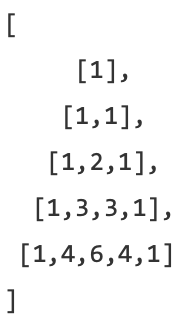

## Dynamic Programming & Greedy
1. Recursion
   - 从大到小思考，从小到大解决问题
   - 把大问题化解成小问题
     - 线性reduction，n问题化解为n-1的问题
     - binary reduction，n问题化解成两个n/2 size的问题，divide and conquer。两半都call？只要其中一半？
   - 小问题小到base case，
     - 要写return，避免stack overflow。
     - base case几个取决于每次recursion跨出去的范围，避免NullPointerException
2. DP
   - 关键：计划存储，一维二维三维n维数组
   - 计划存储可以边做边存，也可以preprocessing提前做好存在一个n size的数组，这样虽然preprocessing花费O(n)，但是之后扫整个n size时，每个都是O(1)直接access这个preprocessing的数组，armortizing一下就是O(1)
   - 基本思想：数学归纳法
     - base case
     - induction rule：从小到大
   - 解题步骤：
     - definition dp[i] 从起点到当前i的题目所问的target，起点不一定是0，可以是尾部
     - base case，start
     - induction rule 状态转移方程，dp[i]和前面的一个两个或者多个有关？
     - Termination，是i = n时？还是dp过程中所遇到的极值？还是过程中产生的中间变量？
     - Optimization，已经空间换时间，往往优化的是空间，
       - 优化方向：2D dp matrix往1D dp array加一个变量，再往一个dp变量，再到inplace操作。
       - 这些都取决于dp的状态转移方程，当前dp[i]是和前面整个matrix有关系？只和上一行/列有关系？只和前面几个val有关系？
       - inplace操作往往是，在填dp时，之前用到的input val之后再也用不到的时候，这些没用的input就可以被replace代替实现inplace操作
   - 题目种类：
     - one sequence
     - Two sequence
     - matrix
     - backpack（很少被考
   - DP hint keywords
     - Max，Min，Longest，Shortest, yes, no, count numbers
     - 单值，一般是0到i的一个单值问题，dp[i]的definition就是这个问的单值，当i到达size n时，往往这个dp[n]就是答案
3. Greedy
   - 贪心的奥义就是每一步都选择当前回合”可见范围“（即可得知的信息）内的最优，而在每一步都仅选择当前回合”可见范围“内的最优这一策略下能够导致全局最优的结果的情况使用贪心就会是正确的，否则不适用贪心（或不适用当前对贪心中的最优的定义）。
   - Q1 Jump Game
   - Q2 Gas Station
     - tie issue: 需要clarify
       - 油箱里只有跑100mile的油，问能不能跑到100 mile的加油站？
       - Meeting room，一个meeting三点结束，一个meeting三点开始，valid？
   - Q3 Candy
   - Q4 Word Break
4. 
## Q1 Fibonacci/Climbing stairs (L???)
1. Description
   - null
2. Clarification
   - null
3. Follow up
   - null
### S1
1. Ideas：
   - recursion
2. Comments:
   - null
3. Code
```java
public long fib(int n) {
	if (n == 0 || n == 1) return (long) n;  // base case
	return fib(n - 1) + ／／ fib(n - 2);  // recursion rule
}
```
### S2
1. Ideas：
   - DP 从小到大
2. Comments:
   - 可以存从1到n所有的值
   - 因为cur只和前两个值有关，可以只存前两个，3个变量足矣
## Q2 L118 L119 L120 Pascal's Triangle
1. Description
   - Given numRows, generate that numRows of Pascal's triangle.
   - 
2. Clarification
   - null
3. Follow up
   - Q2.1 L120 Given a triangle, find the minimum path sum from top to bottom. Each step you may move to adjacent numbers on the row below.
     - 这个path可以类似在tree上的path，区别是tree上每个child只有一个parent，而这里有两个，所以有可能从一个parent已经遍历过child a，而从另一个parent又重复遍历到child a。考虑使用加一个visited field
     - 从上到下的min path sum和从下到上是一样的。而如果是描述的是从上往下，第一反应就是dfs；而从下往上，则可以想到dp。如何解读题目，换一个角度可以更容易想到别的解法
     - 
### S1
1. Ideas：
   - DP
2. Comments:
   - 一个dp优化空间的代表：2D往1D优化
   - cur行只和上一行有关系，和之前的都没有关系
   - 要提前新建一个numRows size的array
   - 从右向左填值，避免从左往右会出现overwrite
### Q2.1 S1
1. Ideas：
   - DFS先办事后call，从上向下遍历每一个path，记录一个global min sum
2. Comments:
   - 时间复杂度：由于每个element不止遍历一次，同时每次call下去两支，一共n层，所以是O(2^n)
   - 每个element被遍历的次数：即该element左上和右上两个parent遍历次数之和，即为帕斯卡三角形的定义，也就是帕斯卡三角形本身
3. Code
```java
public int minPathSum(int[][] matrix){
    int min = max_value;
	dfs(0,0,0, matrix);
}
private void dfs(int i, int j, int sum, int[][] matrix) {
	// base case
	if (i == n) {
		// found a path from top to bottom
		if (sum < min) {
			min = sum;
		}
		return;
	}
	case1:
	dfs(i + 1, j, sum + matrix[i][j], matrix);
	case2:
	dfs(i + 1, j + 1, sum + matrix[i][j], matrix);
}
```
### Q2.1 S2
1. Ideas：
   - dfs先call后办事，自下向上，选取左右child较小的加和向上return
2. Comments:
   - 时间复杂度：依旧分两支，没有计划存储，没有剪枝，先call后办事和先办事后call是一样的，所以还是2^n
3. Code
```java
public …. {
	divideConquer(0,0,matrix);
}
private int divideConquer(int i, int j, int[][] matrix) {
	if (i == n) return 0;
	// 1
    int left = divideConquer(i + 1, j, matrix);
	int right = divideConquer(i + 1, j + 1, matrix);
	// 2
	return matrix[i][j] + Math.min(left, right);
}
```
### Q2.1 S3
1. Ideas：
   - DP = recursion + 计划存储 + prune
2. Comments:
   - 由于S2中recursion在大部分element都重复call，我们可以先把当时的值存下来。同时，如果call的时候发现当前的min path sum已经记录在dp matrix中，我们就不用再call下去了，直接return dp matrix中存的值，达到pruning的效果
   - 时间复杂度：O(n^2)，由于任何一个element只会左上和右上call两次，左上call是第一次，要一路call下去；而右上call由于dp已经存储，直接return，不会再重复call下面的，达到提前pruning的效果，所以每个element只会被至多遍历2次，也就是O((2n)^2) = O(n^2)
3. Code
```java
public …. {
	divideConquer(0,0,matrix);
}
private int divideConquer(int i, int j, int[][] matrix) {
	if (i == n) return 0;
	// if we already have the minimum path sum from (i,j) to bottom, pruning & return
    int left = divideConquer(i + 1, j, matrix);
	int right = divideConquer(i + 1, j + 1, matrix);
	// 2
	dp[i][j] = matrix[i][j] + Math.min(left, right);
	return dp[i][j];
}
```
### Q2.1 S4
1. Ideas：
   - DP，从最后一行填值
2. Comments:
   - dp五个步骤：
     - definition：dp[i][j]到i，j位置的min path sum
     - base case：最后一行，min path sum即为本身
     - induction rule：左右child取较小加cur
     - termination：到达dp[0][0]
     - optimization：当前行只和之前一行有关，只需一个n size的array；同时可以inplace操作，因为matrix[i][[j]用过一次之后再也不会用到了，可以reuse input matrix
3. Code
```java
for (int j = 0; j < n; j++) {
	dp[n-1][j] = matrix[n-1][j];
}

for (int i = n - 2; i >= 0; i--) {
	for (int j = 0; j <= i; j++) {
		matrix[i][j] = Math.min(dp[i+1][j], dp[i+1][j+1]) + matrix[i][j];
	}
}
return dp[0][0]
```
## Q3 longest ascending subarray in an unsorted array
1. Description
   - Unsorted Array, the length of longest ascending subarray/substring / consecutive 1
   - subarray vs subsequence
     - e.g. 5 2 4 1 8 9 7
     - subarray必须要连续的，1 8 9
     - subsequence可以断开， 2 4 8 9
2. Clarification
   - null
3. Follow up
   - descending?
     - induction rule变一下
   - consecutive 1?最长连续1。e.g. 0 0 1 0 1 1 1 1 0
     - induction rule：
       - 如果array[i]是0，则无脑dp填0
       - 如果array[i]是1，看前面是不是0，
         - 是0，dp填1
         - 不是0，dp[i] = dp[i-1] + 1
### S1
1. Ideas：
   - DP
2. Comments:
   - definition：the length of longest ascending subarray from 0 to i (including i) [0, i]
   - base case：dp[0] = 1，即第一个位置最长长度是1
   - induction rule：
     - 如果array[i] > array[i - 1]，dp[i] = dp[i-1] + 1
     - 如果不是，dp[i] = 1
   - Termination：把这与input size相同的n size的dp填完，答案是这个array中的最大值
   - Optimization：dp[i]只和dp[i-1]有关，所以只要一个数记录i-1的信息即可
3. Code
```java
public int longest(int[] array) {
	if (array ==  null || array.length == 0) return 0;
	int[] dp = new int[array.length]; // default值是0，可以使用Arrays.fill(array, 10)来赋非0初值;
	
	dp[0] = 1;
	int max = dp[0]; // 最好不要给magic number，INTERGER.MIN_VALUE

	for (int i = 1; i < array.length; i++) {
		if (array[i] > array[i-1]) {
			dp[i] = dp[i-1] + 1
        // max = Math.max(max, dp[i]); 很危险
		} else {
			dp[i] = 1;
		}
        max = Math.max(max, dp[i]); //标准，套路
	}
	return max;
}
```
After space optimization
```java
public int longest(int[] array) {
	if (array ==  null || array.length == 0) return 0;
	// int[] dp = new int[array.length]; // fillAll();
	
	cur = 1;
	int max = cur;

	for (int i = 1; i < array.length; i++) {
		if (array[i] > array[i-1]) {
			cur = cur + 1
        // max = Math.max(max, dp[i]);
		} else {
			cur = 1;
		}
        max = Math.max(max, cur);	
	}
	return max;
}
```
## Q4 L152 Maximum Product Subarray (L???)
1. Description
   - null
2. Clarification
   - 有正？负？零？
3. Follow up
   - Q4.1 Maximum Product except itself in a random array
     - 每个element有一个除了自己以外其他所有element的乘积，问这n个乘积的最大？
     - 可以每个element都扫一遍剩余n-1个，得到所有n个的乘积比较大小，时间复杂度n^2
     - 有冗余计算，每次都是重新扫剩余的n-1个来计算乘积。可以直接计算整个array的乘积，每到一个element，就把cur用除法除掉就是其余的乘积。这个全部相乘起来有个问题，就是其中包含0的处理方法。如果只有一个0，那么最大乘积就是不是0的所有乘积；如果多个0，那么不管选那个，最大的乘积都是0
   - House Robber
     - e.g. 各个房子中的价值 2 1 3 5 7 2 9 7 2 6
     - 不能同时去两个相邻的房子，问能偷出赃物之和最大？
     - definition dp[i] 从起点到当前i，偷i时的最大值，和不偷i时的最大值，所以dp[i]要记录两个值，可以用2 size int array int[2]来表示
     - base case：
       - dp[0] = {偷，不偷} = {array[0], 0}
     - induction rule：
       - 如果偷当前i，此时的价值就是dp[i-1][不偷] + array[i]
       - 如果不偷当前i，此时的价值就是dp[i-1][偷] + 0
     - Termination，是i = n时偷和不偷取最大
     - Optimization
### S1
1. Ideas：
   - null
2. Comments:
   - null
3. Code
```java

```
## Q5 L53 Maximum Sum of Subarray
1. Description
   - null
2. Clarification
   - null
3. Follow up
   - 输出得到max sum的那个subarray？
     - 在填dp的同时，使用slow fast指针标定cur的subarray
     - 如果发生reset，也就是当前dp[i-1] <= 0，要和global max相比较，当大过global max时，把slow和fast记录（更新）下来，同时reset dp[i]和slow fast
### S1
1. Ideas：
   - DP
2. Comments:
   - definition dp[i] represents the largest sum of subarray from 0 to i (including i) because subarray;
   - base case，dp[0] = array[0]
   - induction rule:
     - if dp[i-1] > 0, dp[i] = array[i] + dp[i-1]
     - if dp[i-1] <= 0, dp[i] = array[i]
   - Termination，dp中的max
   - Optimization：只和i-1有关，只要一个int存i-1就行
3. Code
```java
public int largestSum(int[] array) throws Exception{
	if (array == null || array.length == 0) throw new Exception();
	int len = array.length;

	int dp = array[0];
	int max = array[0];

	for (int i = 1; i < len; i++) {    1 3 2 -7 100
        if (dp > 0) {
            dp += array[i];
        } else {
        dp = array[i];
        }
        if(dp > max) max = dp; //更新必须在if-else之后，不能放到第一个if里
        // 因为前面可能负向贡献，重新开始时，当前正数是global最大。e.g. 1 3 2 -7 100 -200
    }
    return max;
}

```
## Q6 L55 Jump Game
1. Description
   - Given an array of non-negative integers, you are initially positioned at the first index of the array
   - Each element in the array represents your maximum jump length at that position
   - Determine if you are able to reach the last index
   - A = [2,3,1,1,0], return true
   - A = [3,2,1,0,4], return false
2. Clarification
   - 是不是非负？
3. Follow up
   - negative jump back → Frog Jump → 俄罗斯套娃 → 套信封 (L???)
   - Q6.1 最少几次能够jump到？
     - Given an array of non-negative integers, you are initially positioned at the first index of the array Each element in the array represents your maximum jump length at that position. Your goal is to reach the last index in the minimum number of times. Given array A = [2,3,1,1,4], return 2
     - 
### S1
1. Ideas：
   - DFS。直接把能试的path都试一遍，只要有一个能到达end，就是true
2. Comments:
   - 这里由于只要有一个return true，其他recursion call可以不用走了，也就是for loop可以跳的范围内，有一个是true了，别的就可以不走提前剪枝了
   - 这里由于跳的是0~n的长度，如果跳出界了，自然就是能跳到end
   - 时间复杂度：最大步数^n
3. Code
```java
private boolean canJump(int[] array, int index) {
	if (index >= array.length - 1) return true; // base case
	
	int jump = array[index];
	for (int i = 1; i <= jump; i++) { // 从近到远
		if (canJump(array, index + i) return true; // 有一个true，直接return，当前这个for loop就不用做了
	}
	return false;
}
```
### S2
1. Ideas：
   - DP，从右往左填
2. Comments:
   - definition dp[i] true or false，能不能跳到end
   - base case，dp[end] = true
   - induction rule：dp[i]，从i以array[i]的步数往右边看dp，只要有一个是true的，dp[i]就是true
     - dp[i] = true	    if there is / exists a j, i < j <= i + array[i] (不能出界）&& dp[j] == true
	 -         false	otherwise
   - Termination，dp[0]是true还是false
   - Optimization，space可以是O(k)，k是当前最大步数，但如果k远大于n，还是O(n)。可以使用inplace，但是注意这里的类型问题，要在原始array中选取两个不属于其中的两个element代表为true和false，例如这里非负，可以用-1代表true，-2代表false
   - 时间复杂度：O(kn)，k是最大能走的步数
3. Code
```java
public boolean jumpGame(int[] arr) {
	if (arr == null || arr.length < 2) return ; ?
	int n = arr.length;
    boolean[] dp = new boolean[n];

    dp[n - 1] = true;

    for (int i = n - 2; i >= 0; i--) {
        // 由近及远
        for (int j = 1; j <= arr[i]; j++) {
            if (i + j < n && dp[i + j]) { 
                // 也可以写```i + j >= n-1 || dp[i+j]``` 这里是由近及远，所以一步一步走总会遇到最后那个dp[n-1]是true直接break，不会出界，所以可以不check i + j < n
                dp[i] = true;
                break;
            }
        }
    }
    return dp[0];
}

public boolean canJump（int[] array) {
	if (array == null || array.length == 0) return false;
	if (array.length == 1) return true;
	int n = array.length;
	boolean[] res = new boolean[n];
	res[n - 1] = true;
	for (int i = n - 2; i >= 0; i--) {
        // 由远及近
		for (int j = array[i]; j >= 1; j--) {
			if (i + j >= n-1 || res[i + j]) { //这里是由远及近，所以一定要check i + j >= n - 1!
                res[i] = true;
                break;
            }
		}
	}
	return res[0] == true;
}

```
### S3
1. Ideas：
   - Greedy，从左往右走
2. Comments:
   - 每次记录cur能跳到的最远index
   - for loop所有能跳到（包括最远的位置），看看能不能使得增大最远的index
   - 更新完最远的index，可以跳到的点就更多了，继续遍历这些点
   - 直到把最远的index大于等于整个array.length；或者，最远index没有到达end，同时已经把包含最远index以及之前的所有都遍历过了的时候，此时return false
3. Code
```java
public boolean canJump(int[] nums) {
	//cc
    int maxRange = 0;
    for (int i = 0; i <= maxRange; i++ ){ // 这里maxRange可以动态变化
        maxRange = Math.max(maxRange, i + nums[i]);
        if (maxRange >= nums.length -1) return true;
    }
    return false;
} 
public boolean canJump(int[] nums) {
	int maxReach = 0;
	for (int i = 0; i < nums.length; i++) {
		if (maxReach < i) return false;
		maxReach = Math.max(maxReach, i + nums[i]);
		if (maxReach >= nums.length - 1) return true;
	}
	return true;
}
  
```
### Q6.1 S1
1. Ideas：
   - DFS，彻底遍历所有可能的路径，每次call记录当前层数（步数），到达底部时返回总的步数，与global value相比尝试更新
### Q6.1 S2
1. Ideas：
   - DP，从右向左填
2. Comments:
   - definition dp[i]站在当前index i，跳到end所需的最小步数
   - base case，dp[end] = 0
   - induction rule：
     - dp[i] = min(dp[i+1]到dp[i+array[i]]的所有值) + 1
   - Termination，dp[0]即答案
   - Optimization：空间复杂度：O(n) --> O(k)，k是最远步数
   - 时间复杂度：O(kn)，k为最远跳的步数
   - 这里要注意的是如果index i是0的情况，根本跳不出去的情况。我们可以把整个dp这个array每个位置初始化为n，n是这个array的size，说明最多n步才能跳到，而实际上在非负情况下， 最多n-1步即可跳到，等于初始一个最大的不可能越界（虽然size可以很大，还是得先clarify一下这个size...)的值，这样更新dp时不会跳到这个0，陷在这个0中
   - 这样是0的地方不会被更新，保持n，相对最大的同时，可以保证其他在其前面的值不会选择跳到这个0。所以最后要check dp[0]是不是n，是n说明跳不到，不是n则说明可以跳得到
3. Code
```java
public int jumpGame(int[] arr) {
	if (arr == null || arr.length < 2) return ?;
	int n = arr.length;
    int[] dp = new int[n]; // by default 0, 变程你要的初始值 dp.fill()
    dp[n - 1] = 0;

    for (int i = n-2; i >= 0; i--) {
        int min = Integer.MAX_VALUE;
        for (int j = 1; j <= arr[i]; j++) {
            if (i + j < n) min = Math.min(min, dp[i+j]);
        }
        if (min == Integer.MAX_VALUE) dp[i] = Integer.MAX_VALUE;
        else dp[i] = min + 1;
    }
    return dp[0];
}
```
### Q6.1 S3
1. Ideas：
   - Greedy，一步尽量跳更远
2. Comments:
   - null
3. Code
```java
public int jump(int[] nums) {
    if(nums == null || nums.length < 2) return 0;
    int result = 0; // 当前所跳的最远花费的步数
    int preMax = 0; // 记录之前能cover的result跳的最远的位置，当i到达preMax时，result要+1了
    int curMax = 0; // 不断更新cur能到达的最远位置，i到达preMax+1时，result+1，preMax = curMax，在i到preMax直接能够跳到preMax以外的时候，curMax推到preMax以外，preMax到curMax就是再加一步能跳的范围
    for(int i = 0; i < nums.length; i++) { // use curMax to justify whether you can hit the target or not: 
        if(curMax >= nums.length - 1) return result + 1; 
        if(i > preMax) {
            preMax = curMax;
            result++;
        }
        curMax = Math.max(cur, i + nums[i]); // i vs cur
    }
        return ?; // can't jump
    }

```
## Q7 Cut Rope (L???)
1. Description
   - (http://www.geeksforgeeks.org/dynamic-programming-set-36-cut-a-rope-to-maximize-product/)
   - Given a rope of length n meters, cut the rope in different parts of integer lengths in a way that maximizes product of lengths of all parts. You must make at least one cut. Assume that the length of rope is more than 2 meters
2. Clarification
   - null
3. Follow up
   - Cut Stone
   - Merge Stone
   - 排好序 或者 只能相邻两个 vs 任意两个
### S1
1. Ideas：
   - DFS，linear reduction，一共n-1个位置，n-1层，切还是不切，把每个情况都算一下，取个最大值
### S2
1. Ideas：
   - DFS，binary reduction，切一刀，问左右两边最大值
### S3
1. Ideas：
   - DP，binary reduction
2. Comments:
   - definition dp[i] 切i米长绳子的最大乘积，__且至少切一刀__。这里是至少切一刀，但是当i问题问i-1的问题时，对于i-1来说，我们没有这个限制条件，所以有些情况这个i-1并不是直接等于dp[i-1]，例如这里，dp[i-1]是至少切一刀的最大情况，在填dp[i]时，对于dp[i-1]并没有要求至少切一刀，所以没切的情况也要考虑！在这里要取这两种情况最大值。
   - base case，有时候先看后面，再返回来推
     - dp[0] = 从后推论看，dp[0]根本用不到，随便给个0就行
     - dp[1] = 0 vs 1，从后面看，只要不超过1就行
     - dp[2] = 1
     - dp[3] = 2    _ | _ _ = max(dp[1], 1) * max(dp[2], 2)
     -              _ _ | _ = max(dp[2], 2) * max(dp[1], 1)
     - dp[4] = ?	_ | _ _ _ left: dp[1], right: dp[3]   sol1 = max(1, dp[1]) * max(3, dp[3])
		            _ _ | _ _ left: dp[2], right: dp[2]   sol2 = max(2, dp[2]) * max(2, dp[2])
		            _ _ _ | _ left: dp[3], right: dp[1]   sol3 = max(3, dp[3]) * max(1, dp[1])
		            dp[4] = max(sol1, sol2, sol3)
   - induction rule：
     - dp[i]:
     - _ _ j _ _i
     - for loop j，取乘积最大值
     - 这里切一刀会对称，j不用走到i，j从 1 走到 i/2 就行
   - Termination，dp[n]
   - Optimization
   - 时间复杂度：O(n^2)
   - 数学方法优化：
     - O(1)时间得到什么时候该切，什么时候不该切。
       - 当长度小于4，不切大，当长度大于4，切更大（等于4，一样）
     - 切的时候该切哪里？即问：a + b固定，求ab乘积最大？a和b尽可能接近则取最大
3. Code
```java
for (int i = 1; i <= n; i++) {// i meters
	int curMax = 0;
	for (int j = 1; j <= i/2; j++) {
		// update max when needed
		int curValue = Math.max(j, dp[j]) * Math.max(i - j, dp[i-j]);
		curMax = Math.max(curMax, curValue);
	}
	dp[i] = curMax;
}

```
## Q8 L140 Word Break (L???)
1. Description
   - Given a string s and a dictionary of words dict, add spaces in s to construct a sentence where each word is a valid dictionary word. Return all such possible sentences / true false;
   - s = "catsanddog" no duplicate word
   - dict = ["cat", "sand", "dog"]
2. Clarification
   - null
3. Follow up
   - null
### S1
1. Ideas：
   - DFS
### S2
1. Ideas：
   - DP，2D matrix存储
### S1
1. Ideas：
   - DP，1D array存储
2. Comments:
   - definition：dp[i] represents if we can form the string, whose index from 0 to i, with words from dict
     - [0, i) → first i letters
   - base case：
     - e.g. s = "catsand"
     - dp[0]: true
     - dp[1]: false	c
     - dp[2]: false	c|a
     - dp[3]: true	cat
     - dp[4]: 	cat | s
     - ...
     - dp[7]:	true	cat|sand
     - 这里右边只要call dictionary.contains即可，比如catsanddog，尽管cat|sanddog这样切右边不在dictionary里，但是因为for loop要切完，也就是切到catsand|dog这时候，catsand之前切过cat|sand，判断是true，而这里只要check dog在不在dictionary里就行了
   - 这里dictionary.contains的调用次数，首先一开始要check整体，然后就是一个一个切的时候切成左边是true的情况，右边就也要调用dictionary.contains了。这里可以假设切一刀切在整个串的起始index 0的位置，这样整串就在切的右边，依然调用dictionary.contains，这时候由于切得左边是个空的，也就是dp[0]，为了只有右边check dictionary.contains来决定结果，dp[0]设成true才合理。
   - 这里发现每次for loop都是一个一个切，但实际上，左边能是true的之前已经知道了，我们不用一个一个切过来，只要切左边能切成true的位置就行了，可以存切成true的index的一个list。之后只要for loop这个list就行了，虽然时间复杂度依然是O(n^2)，但实际上大大加快速度了。注意这里list要含有切0这个位置，也就是先判断整体是不是在dictionary里的一步
   - Greedy 思想，在dictionary中，如果不存在word和word的overlap，
     - ["cat", "sand", "dog"]不存在
     - ["cat", "sand", "sanddog"] 存在
     - 当不存在overlap时，对于dp[i]存的list，可以优化到只存左边能切出最长是true的index，但我感觉不大好
3. Code
```java
public boolean wordBreak(String s) {
	// cc 
	int n = s.length();
	boolean[] dp = new boolean[n + 1];
	dp[0] = true;
   for (int i = 1; i <= n; i++) {
      for (int j = 0; j < i; j++) {
         if (dp[j] && isContains(s.substring(j, i))) {
            dp[i] = true;
            break;
         }
      }
   } 
   return dp[n];
}

class Solution {
   public boolean wordBreak(String s, List<String> wordDict) {
      List<Integer> index = new LinkedList<>();
      index.add(0); //每次判断整体是不是在dictionary里！
      for(int i = 1; i <= s.length(); i++) {
         for(int id: index) {
               if(wordDict.contains(s.substring(id, i))) {
                  index.add(i);
                  break;
               }
         }
      }
      return index.contains(s.length());
   }
}

```
## Q1 (L???)
1. Description
   - null
2. Clarification
   - null
3. Follow up
   - null
### S1
1. Ideas：
   - null
2. Comments:
   - null
3. Code
```java

```