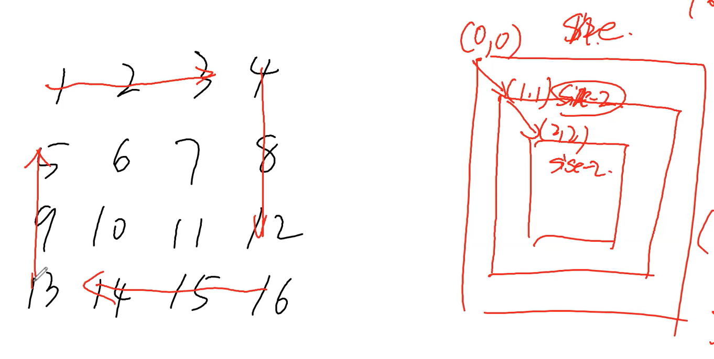

## Recursion & Divide and Conquer
1. Reverse 什么什么，reverse array, string, linkedlist, integer, bits, tree(invert, upside down)
   -  Recursion vs Tree 
   -  Why? tree is defined with recursive way vs backtraciing multiple branch
   -  Base Case: null, leaf node, false
   -  Recursive Rule: 
   -  why BST? recursion → while
      -  大部分情况只走一个子树，另一个子树不走了
   -  bottom up // no need to carry on → dp
      -  1 ask left child/subtree and ask right child/subtree
      -  2 do something in current level
      -  3 return something
2. how to store something if you need dp like solution for tree → dp
   - 可以在treenode额外加个field用来consistent记录visited或者其他的dp信息
## Q1 L51 L52 N Queen
1. Description
   - put n queens in a n x n size matrix
2. Clarification
   - null
3. Follow up
   - null
### S1
1. Ideas：
   - dfs
2. Comments:
   - sol使用n size int array记录每行的queen的位置，sol[i]记录第i行的queen在sol[i]列
   - base case: 走到底部，即把n size的sol填满。同时把sol加到result中
   - recursion：for loop每行的每列，用sol来infer之前queen的位置来判断当前位置是否valid：
     - valid：sol加入这个位置信息，dfs去call下一行level+1，继续for loop找valid 列
     - 不valid：continue，直到valid或者for loop完
   - 时间复杂度：dfs每次要for loop n 列，dfs 最多call n 行，每次isValid的check要花费O(n)
     - 第一层：for loop n次的O(n)
     - 第二层：n*n次的O(n)
     - ...
     - 第n - 1层：n^(n-1) 次的O(n)
     - 总的是O(n^n)*O(n)
   - 优化：isValid，用空间换时间，计划存储，使用三个boolean array来记录历史上列方向投影，45度方向投影，135度方向投影的queen出现情况，在call isValid时，O(1)直接得到
     - 列方向是n size
     - 45度是左下向右上投影，size是2n-1，已知任意坐标i，j，对应到的投影的array的index  是i+j
     - 135度是右下向左上投影，同理，任意坐标i，j，对应到的投影array的index是i-j+n-1
3. Code
```java
void dfs(int[][] matrix, int level, int[] sol, List<int[]> result) {
	if (level == matrix.length) {
		result.add(//sol//); // must do deep copy sol.clone(); → copyof ;
		return;
	}
	for (int i = 0; i < matrix[0].length; i++) {
		// sol[level] = i; ?
		if (isValid(sol, level, i)) {
			sol[level] = i;
			dfs(matrix, level + 1, sol, result);
			// wall
			// sol[level] = -1; 可以不用backtracing，因为这里for loop是固定对sol[level]赋值，只要在dfs往下recursion前赋予新的值就可，但是如果使用的是list，而且添加过程是list.add，每次手动加一个值，如果不做backtracing，会无限的加在队尾，这种情况一定要backtracing
		}
	}
	// return ?
}

```
## Q2 L36 L37 Sudoku Solver  (L???)
1. Description
   - null
2. Clarification
   - null
3. Follow up
   - null
### S1
1. Ideas：
   - null
2. Comments:
   - how to search 9 elements with i j centered？
   - 提前定义一个8 size array {(-1,-1), (-1,0), (1,1), (0,-1), (0,1), (1,-1), (1,0), (1,1)}表示8个方向，直接从center来for loop这个8 size array来遍历九宫格
3. Code
```java
```
## Q3 L54 L59 spiral print matrix clockwise print
1. Description
   - square
2. Clarification
   - null
3. Follow up
   - Q5.1 counter clockwise
     - 四个for loop方向变一下
   - Q5.2 顺逆交替
     - 可以使用flag，dfs把flag传下去
   - Q5.3 m * n rectangle
     - 正方形唯一的size变成colsize和rowsize
     - 同时base case中
       - size是0的case变成两个，看colsize或者rowSize哪个先到0
       - size是1的case也是变成两个，colsize或者rowSize哪个先到1
   - Q5.4 input int n without extra space, square
     - 给size是n的square matrix，从1到n^2按row铺满
     - 同样采用S1方法，只不过在print的时候通过matrix的i和j来反推要print的val
     - 2D matrix的index转到1D array的index，再通过1d的index到val的对应关系（这里就是+1，可以是等差数列）得到val。这里```offset * n + offset + i + 1```的col是n，坐标对应关系，而不是变化的size。
   - Q5.5 input int m int n without extra space, rectangle
   - Q5.6 input int n, output the matrix / printout
     - 螺旋赋值输出这个matrix
       - 使用一个counter，每次for中对对应所当前遍历到的matrix位置赋值counter，然后counter++
     - 螺旋赋值但是按行打印出来这个matrix
       - S1，先得到这个matrix，然后print by row
       - S2，坐标对应关系
### S1
1. Ideas：
   - dfs
2. Comments:
   - 
   - 铆合结构
   - print时注意起始和终点的index
   - base case有两种，奇和偶
3. Code
```java
void spiral(int offset, int size, int[][] matrix) {
	// base case
	if (size == 0) return;
 	if (size == 1)  print the last matrix[offset][offset] and return;

    for (int i = 0; i < colsize - 1; i++) { // matrix[offset + i][offset]
        matrix[offset][offset + i] //→ offset * n + offset + i + 1
    }
	for (int i = 0; i < rowsize - 1; i++) {
        matrix[offset + i][offset + size - 1]
    }
	for (int i = 0; i < colsize - 1; i++) {
        matrix[offset + size - 1][offset + size - 1 - i]
    }
	for (int i = 0; i < rowsize - 1; i++) {
        matrix[offset + size - 1 - i][offset]
    }	
	spiral(offset + 1, size - 2, matrix);
}

```
## Q4 how many nodes in left/right subtree for every node O(1)? (L???)
1. Description
   - null
2. Clarification
   - null
3. Follow up
   - Q4.1 Count Complete Tree Nodes
```java
public int countNodes(TreeNode root) {
	if (root == null) return 0;
	int countLeft = countNodes(root.left);
	int countRight = countNodes(root.right);
	return countLeft + countRight + 1;
}
```
   - Q4.2 find a node with max difference nodes number between left subtree and right subtree
```java
public int countNodes(TreeNode root) {
	if (root == null) return 0;
	int countLeft = countNodes(root.left);
	int countRight = countNodes(root.right);
	// do sth update global max when possible
	return countLeft + countRight + 1;
}
```
     - 在recursion过程中，如何keep一个global var？
       - 写在field，对于method来说就是global var。
         - 缺点就是对于不同的case要new不同的solution，才能确保不同的case有其所对应的global var。浪费空间。
         - 另一种方法是在前一次用完global时，call一个reset的method，来reset global var，这样使用相同的solution object就不会影响下次的case了，但是每次要用户手动调用reset method，不符合OOD，也不user friendly
         - 但可以把main method和reset method wrap成一个method，用户直接调用这个就自动reset了
```java
class Solution {
    // fields
    int global_max = ?
    TreeNode global_max_node = ?

    // methods
    public void traverse(TreeNode root) {
        // reset
        countNodes(root);
    }
    private int countNodes(TreeNode root) {
        if (root == null) return 0;
        int countLeft = countNodes(root.left);
        int countRight = countNodes(root.right);
        if (Match.abs(left - right) > global_max) {
                global_max = Math.abs(left - right);
                global_max_node = root;
            }
        return countLeft + countRight + 1;
    }
}
```
       - method传入global var被list object所wrap，通过对list dereference到heap中global var来更新global var
```java
public int countNodes(TreeNode root, int[] max, TreeNode[] max_node) {
	if (root == null) return 0;
	int countLeft = countNodes(root.left);
	int countRight = countNodes(root.right);
	if (Math.abs(left - right) > global_max) {
        max[0] = Math.abs(left - right);
        max_node[0] = root;
    }
	return countLeft + countRight + 1;
}
```
      - input进去再return出来，recursion一路传递
        - java return的是多object，要wrap成一个object
```java
//Max difference
private int[] getNode(TreeNode root){
   if(root == null) return {0,0};
   int[] left = getNode(root.left);
   int[] right = getNode(root.right);
   // wall
   max = Math.max(Math.abs(left[0] - right[0]), left[1], right[1]);
   return new int[] {left[0] + right[0] + 1, max};
}
```
      - 多个thread中的global var，多个recursion
        - singleton：多个thread access到一份copy
        - static：多个包含static修饰的object中，这个static所修饰的field/method是一份
        - volatile？
### S1
1. Ideas：
   - null
2. Comments:
   - preprocessing得到个数信息，之后边做边存。Amortize平摊之后就是O(1)
3. Code
```java
public int countNodes(TreeNode root) {
	if (root == null) return 0;
	int countLeft = countNodes(root.left);
	int countRight = countNodes(root.right);
	root.left_subtree_nodes = countLeft;
    root.right_subtree_node = countRight;
	return countLeft + countRight + 1;
}
```
## Q5 L236 Lowest Common Ancestor(LCA)(L???)
1. Description
   - given 两个TreeNode p和q，以及root，求p和q的LCA
2. Clarification
   - 有没有parent指针？
     - 有直接向上找，就是intersection of two linked list
   - LCA是不是一定有？
     - 也就是说p和q都在root这同一个tree中
3. Follow up
   - Q5.1 apply LCA on binary search tree
     - binary tree能做的BST依旧能做
     - BST中val无重复的特性，可以直接给val
     - LCA一定在[p, q]
     - 同时从root出发，第一个落到[p, q]这个range的TreeNode的就是LCA
     - 为何第一个？反证法：如果其不是，左子树是个LCA的话，左子树中包含p和q，所以parent比p和q都大，而parent又是LCA，矛盾
   - Q5.2 apply LCA with parent no left right
     - parent 指针，直接往上找
   - Q5.3 apply LCA to k nodes 2 branches → only change the base case to 1 + k
     - 二叉树中多个node 的LCA
     - 基本类似原来两个node的LCA，只不过在base case加入这些多个node时，return这多个node
   - Q5.4 apply LCA to 2 nodes k branches → for every branches
     - 改变向上return的条件
       - 如果children都是null，return null
       - 如果有一个child不是null，return这个child
       - 如果有两个child不是null，return当前node
       - 需要count记录有几个child不是null
       - 同时需要记录如果是一个不是null，那个不是null的node记录到tempNode中，return这个tempNode
```java
int counter = 0;
TreeNode tempNode = null;

for () {
    TreeNode returnNode = ?;
    if (returnNode != null) {
        counter++;
        tempNode = returnNode;
    }
}
```
   - Q5.5 apply LCA to m nodes k branches → only check 0 1 >=2
     - 改变向上return的条件
       - 如果children都是null，return null
       - 如果有一个child不是null，return这个child
       - 如果有两个child以及两个以上child不是null，return当前node
       - 需要count记录有几个child不是null
       - 同时需要记录如果是一个不是null，那个不是null的node记录到tempNode中，return这个tempNode   
   - Q5.6 不保证一定有
     - 先check是否在一个tree上
### S1
1. Ideas：
   - dfs，先call后办事
2. Comments:
   - 发现p或者q，return p或者q，如果不是p或者q，return null
   - 看左右子树return出来的是啥：
     - 如果都是null，return null
     - 如果有一个不是null，return那个不是null的
     - 如果两个都不是null，说明这两个就是p和q，return当前node
   - 由于“如果有一个不是null，return那个不是null的”，能够保证LCA可以直接return到recursion最外边
   - 有个edge case就是p或者q其一就是LCA，
     - 如果p和q不一定在这同一个root的tree中，得先check p和q是否在这同一个tree。如果q不在这个tree中，由于base case中check到ship或者q直接return了，下面的q就完全check不到了，这个方法做出来p就是LCA，就是有问题的
     - 在保证p和q是一个tree时，这个edge case可以被cover
3. Code
```java
public TreeNode LCA(TreeNode root, TreeNode p, TreeNode q) {
	if (root == null || root == p || root == q) return root;

	TreeNode left = LCA(root.left, p, q);
	TreeNode right = LCA(root.right, p, q);

	if (left != null && right != null) return root;

	if (left != null) return left;
	if (right != null) return right;
	return null;
	// return left != null ? left : right;
}
```
## Q6 L124 Binary Tree Maximum Path Sum (any node to any node)(L???)
1. Description
   - Given a binary tree, find the maximum path sum, For this problem, a path is defined as any sequence of nodes from some starting node to any node in the tree along the parent-child connections. The path does not need to go through the root
2. Clarification
   - 这一系列问题，都是要拿到node到当前node的信息，也就是下面子树的信息，所以最好还是先call到底层，再返值做
3. Follow up
   - Q6.1 Given a binary tree, find the maximum path sum from any leaf node to any leaf node
     - any leaf to any leaf，有个LCA，这个LCA到各个leaf就是leaf to any node
     - 两个分别求一下max sum，加和同样是max sum
     - 每个node下面从leaf node返上来的max path sum包含了以该node为LCA的所有leaf to leaf的pair
   - Q6.2 Given a binary tree, find the maximum path sum from any leaf node to root node (root to leaf)
     - 最简单！ 	
   - Q6.3 Given a binary tree, find the maximum path sum from any node to root node    
     - 参考Q6.2，不过在办事过程中，看左右子树，如果是负向贡献，直接return root.val，从新开始
     - 两个都是正的就选择较大的return上去
     - 单边的edge case也是一样，如果单边是负向贡献，也是砍掉不要了             
   - Q6.4 Given a binary tree, find the maximum path sum from one any node to any leaf
     - 见Q6.2 S1
   - Q6.5 Given a binary tree, find the maximum path sum from any to any, return the Maximum sum Path.
     - 只能自下向上传path 信息
     - use global max to store the max sum
     - return maximum sum with straight path(or subPath)
     - left_return + right_return + cur.value vs max
     - use 0 to prune better
### Q6.2 S1
1. Ideas：
   - dfs
2. Comments:
   - 这里注意base case，单边有null的edge case，当null return 0时，如果单边另一个child是负数，则会return这个0，有问题！三种处理方法
     - recursion 只call到leaf node
     - call 到 null，返值的过程中处理单边edge case。直接看left和right是不是有且只有一个是null的case
     - null直接return INTEGER.MIN_VALUE，肯定比负数小，不好，因为引入magic number
   - 这里先call后办事的办事过程中，能够拿到leaf to any node的path sum，就是Q6.4
3. Code
```java
public int maxSum(TreeNode root) {
	／／ 1
	if (root == null) return Integer.Min_Value; // only one node.
	int left = maxSum(root.left);	 // check -inf
	int right = maxSum(root.right); // check -inf
    if (root.left == null && root.right == null) return root.val;
    if (root.left == null) return root.right.val + root.val;
    if (root.right == null) return root.left.val + root.val;
    return Math.max(left, right) + root.val;
}
```
### Q6.3 S1
1. Ideas：
   - null
2. Comments:
   - null
3. Code
```java
public int maxSum(TreeNode root) {
	if (root == null) return 0;
	int left = maxSum(root.left);
	int right = maxSum(root.right);
	return Math.max(0, Math.max(left, right)) + root.val;
	// return (Math.max(leftMax, rightMax)+ root.val) > root.val ? (Math.max(leftMax, rightMax)+ root.val) : root.val;
}

```
### Q6.1 S1
1. Ideas：
   - null
2. Comments:
   - null
3. Code
```java
public int maxSum(TreeNode root) {
	if (root == null) return 0;
	int left = maxSum(root.left);
	int right = maxSum(root.right);

    // update global max if needed?
    max = Math.max(max, left + right + root.val);

	return Math.max(left, right) + root.val;
}
```
### S1
1. Ideas：
   - Q6.1 + Q6.3 !
2. Comments:
   - null
3. Code
```java
public int maxSum(TreeNode root) {
	if (root == null) return 0;
	int left = maxSum(root.left);
	// ?
	int right = maxSum(root.right);
    // update global max if needed?
    max = Math.max(max, left + right + root.val);

	return Math.max(0, Math.max(left, right)) + root.val;
}

```
## Q7 Path Sum II return path (L???)
1. Description
   - Return path sum的path，也就是path的TreeNode
2. Clarification
   - null
3. Follow up
   - Q7.1 Given a binary tree, find the maximum path sum from one root to any leaf, print path → DFS
     - 从上往下思考，先办事再call
     - 先把当前的val加到curSum里，还要把经过的node记录到sol里，然后分别call左右子树
     - 当call到底时，和global max比较，更大的话把这个path也更新到maxPath里
   - Q7.2 Given a binary tree, find the maximum path sum from one leaf to root, print path
     - 从下向上思考
     - 先call到最底部，leaf node就return自己的val
     - 各个node，看左右子树那个return上来的大，加上本身再return上去
     - 注意return的同时把大的那个方向的treenode list加上当前node
   - 这里Q7.1和Q7.2唯一区别就是方向，但是自上向下会好一点，因为自下向上要记录path list时，每次都renew一个新的list，麻烦
### S1
1. Ideas：
   - null
2. Comments:
   - null
3. Code
## Q8 L113 Path Sum to Target Path Sum III return path add up to target (L???)
1. Description
   - null
2. Clarification
   - null
3. Follow up
   - Q8.1 Given a binary tree and a target, __find all__ root-to-leaf paths where each path's sum equals the given target
     - 类似Q7，自上到下dfs，从root到leaf，记录path sum，如果等于target，把这个sol加到result里
   - Q8.2 Given a binary tree and a target, __check if__ there is a root-to-leaf path where each path's sum equals the given target
     - 类似Q8.1有一个path sum是target，要快速return这个true的信息，直接剪枝别的。可以使用global flag
   - Q8.3 Given a binary tree and a target, find all any to any paths where each path's sum equals the given target
     - 自下向上做，左右child要return一个path，在当前node，讲两边的path一接，组成一个array，在这个array中找有没有subarray的sum等于target
   - Q8.4 Given a binary tree and a target, check if there is a any to any path where each path's sum equals the given target
     - 类似Q8.3
### S1
1. Ideas：
   - null
2. Comments:
   - null
## Q1 (L???)
1. Description
   - null
2. Clarification
   - null
3. Follow up
   - null
### S1
1. Ideas：
   - null
2. Comments:
   - null
3. Code