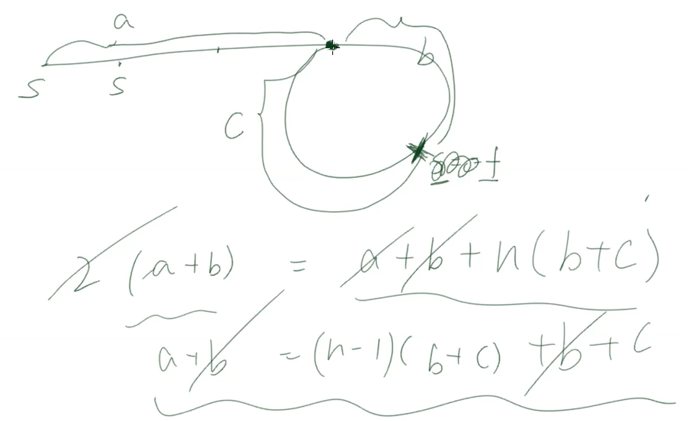

## LinkedList & Queue & Stack
1. Single linked list
   - ListNode 1 --> ListNode 2 --> ListNode 3 --> ListNode 4 --> __null__
2. 使用LinkedList，List？ListNode?
3. LinkedList在stack heap中存储方式：
   - stack存第一个ListNode的reference
   - 对于每一个存于heap中ListNode object，object的field存了除了本身的value，同时还存了下一个ListNode的reference（一般是.next）
   - 对于最后一个ListNode，.next指向的是null
4. LinkedList注意事项：
   - head是唯一一个能访问到所有ListNode的数据结构，所以一般来说head轻易不要动
   - 每次访问下一个用的是.next，注意NullPointerException
   - 遍历到最后的node，挂的是null，这个null表达的是遍历这个linkedlist的终止条件，同时这个null表达了这个linkedlist是可以动态变化的，可加可减
   - 不连续存储
   - 找一个node，都要从头遍历，所以是O(n)
5. Array
   - 同样stack只存第一个元素的reference，但是后面所有的元素都是在heap中的内存中连续存储，也就是说，第二个元素的reference就是第一个reference加上index的差值，这个过程是O(1)
   - 连续存储
   - 找一个数，内存中连续存储，靠第一个元素的reference地址和偏差值O(1)直接拿到
   - 空array: int[] array = new int[0];
   - 如果是用ArrayList，由于ArrayList是用array实现list的功能，也就是要O(1)，随机访问，所以为了要可变长度，每当长度不够用时，系统会从新分配一块连续的更大的内存空间提供使用（例如是当前size的两倍）
   - 对于ArrayList，由于是可变化的，ArrayList在initial时不提供长度的话是生成一个default size的array，所以如果是：```List<Integer> list = new ArrayList<>();```，虽然call其中size的function返回的是0，但实际上在内存heap中已经有个default size（capacity）的array在待机中，在ArrayList的这个是capacity，和int []的size是有区别的
6. LinkedList的corner case：
   - head == null，head.next == null
7. 使用while loop遍历linked list:
   - 跳出条件：
     - cur == null，跳出时，cur停在末尾挂的null上，推荐这个
     - cur.next == null，跳出时，cur停在最后一个listnode
8. ListNode在java中：
   ```java
   class ListNode<T> { //generics泛型只接受object，所以只能是Integer，而不是int
       // fields
       T value;
       ListNode next; // TreeNode left; 可以实现TreeNode和double linked list的inplace相互转换
       ListNode prev; // TreeNode right;
       // TreeNode[] array 每个node固定子树个数
       // List<TreeNode> neis 每个node变化子树个数
       // HashMap<TreeNode> neis 每个node通过给定key进行访问，例如trie
       // graph 中，有个visited的field用来check是否重复遍历，也就是是否存在环
       ListNode(T Val) {
           value = val;
           next = null;
           prev = null;
       }
   }
   ```
9. dummy node作用是用dummy.next定位出return的head，一般是第一个要接的ListNode不明朗是可以无脑使用dummynode
    - dummy node 创建时给里面的value一般来说不影响做题，但有时候要注意这个value可能会影响
    - 一般可以通过preprocessing预处理来得到需要return的head，避免创建dummy node
10. sort array 和 linked list 各种sort algorithm的区别和联系*
11. 
## Q1 Reverse Linked List (L206)
1. Description
   - reverse linked list，返回翻转的head
2. Clarification
   - null
3. Follow up
   - Q1.1 L24 L25 reverse linked list by two/three/k
     - 1 2 3 4 5 6 7 8 -> null
     - 2 1 4 3 6 5 8 7 -> null by two
     - 3 2 1 6 5 4 7 8 -> null by three
       - 要clarify最后小于3的部分是reverse还是保留
   - Q1.2 L92 reverse linked list by range
     - 1 2 3 4 5 6 7 -> null
     - 1 2 6 5 4 3 7 -> null target range is 3 4 5 6
     - 对于single linked list来说，难点是直到cur而很难知道cur的parent
     - 所以如何给range决定了题目的难易，这里如果给2和6 node的reference会很简单，因为知道了2和6，3和7都知道了，断开和接上的node都知道了
### S1
1. Ideas：
   - 依次遍历
   - 先create一个dummy node
   - 遍历第一个，接到dummy node后面
   - 第二个，插在dummy node与后面node之间
   - 以此类推
2. Comments:
   - null
### S2
1. Ideas：
   - iteration 遍历所有node，让node向后指的变成向前指
2. Comments:
   - 用cur遍历，不要用head去遍历，尽量不要丢失head的reference
   - 需要一个prev来记录当前node之前的那个node，这样才能反转之后接这个prev
   - 当cur.next指向了prev，我们需要个temp node来保存后面的node的reference，否则会丢失后面一系列node的信息
   - 终止状态是cur走到最后挂的null，此时的prev就是要返回翻转好的头结点，当然也可以cur.next == null作为跳出条件，此时return的head就是cur
   - 初始状态，prev设为null，cur为head，next作为temp存值，初始成什么都没有太大关系。
   - prev为null，这样当cur（head）指向prev正好完成翻转之后的尾部（cur）挂null的操作
3. Code
   ```java
   public ListNode reverse(ListNode head) {
       if (head == null || head.next == null) {
           return head;
       }
       ListNode cur = head;
       ListNode prev = null;
       ListNode next = null;
       while (cur != null) {
           next = cur.next;
           cur.next = prev;
           prev = cur;
           cur = next;
       }
       return prev;
   }
   ```
### S3
1. Ideas：
   - recursion 先call得到之后return上来已经reverse好的linkedlist，然后在把当前的cur接在尾部，然后把当前reverse的head return上去
2. Comments:
   - 这个recursion是先call到底，在到底return的过程中reverse，很多题目有类似的情况，即遍历顺序和操作顺序相反，要遍历到最后一个才能操作的情况就可以采用这种recursion的方法
   - 这里recursion call小问题的答案return上来，根本不用关心这个cur.next所组成的sub linkedlist是怎么reverse的，只要把当前的cur加到这个return上来的linkedlist 再return上去，这个return上去的也是包含cur已经做了reverse的linkedlist
   - 这里call返回的是newHead，同时return的时候也是newHead，可以看成call到base case（即最后一个非null的node)，把最后一个node一路return上来
3. Code
   ```java
   public ListNode reverse(ListNode head) {
       if (head == null || head.next == null) {
           return head;
       }
       ListNode newHead = reverse(head.next);
       head.next.next = head;
       head.next = null;
       return newHead;
   }
   ```
### Q1.1 S1
1. Ideas：
   - recursion 先call得到之后return上来已经reverse好的linkedlist，然后处理当前cur的情况，create新的reverse好的head return上去
2. Comments:
   - 这里by two的话，也就是一次跨两个node，所以base case要保证跨两步不会有nullPointerException
   - reverse k个，就得跨k步，base case就得check这k个是否有null，最后那段小于k的话需要clarify如何处理，是不改变还是reverse？
   - 当by k时，每个recursion要reverse一个sub linked list，所以这个可以单独写个function做这个sub problem，注意这个reversebyone的sub function要输出头尾节点为了在接回原来的linked list，有些微区别
   - by k时，base case要用while loop遍历，当cur不是null，就向后遍历，直到遍历到k个或者遇到null跳出
3. Code
   ```java
   public ListNode reverseByTwo(ListNode head) {
       if (head == null || head.next == null) {
           return head;
       }
       ListNode subHead = reverseByTwo(head.next.next);
       ListNode newHead = head.next;
       head.next.next = head;
       head.next = subHead;
       return newHead;
   }
   ```
## Q2 find middle node in linkedlist
1. Description
   - 一般意义上middle就是head到null的中间位置
2. Clarification
   - 找middle时要注意奇偶
3. Follow up
   - 找1/3位置，3/4位置
     - 需要clarify如果除下来是个小数，是floor还是四舍五入？
   - Q2.1 single linked list, kth position to the right (L19)
     - slow fast指针，fast先走k个，然后slow fast齐步走，直到fast到null，此时slow即为kth position to the right
### S1
1. Ideas：
   - slow fast指针，每次slow走一步，fast走两步，fast到null时slow即为middle
2. Comments:
   - 注意奇偶问题，三种处理方法（推荐第三种）
     - s和f初始在head，check ```fast.next != null || fast.next.next != null```，注意preprocessing，小心nullpointerexception
     - 创建一个dummy node，s和f初始在dummy node，s一步，f两步，check ```fast != null || fast.next != null```
     - preprocessing，确保head和head.next都不是null，s初始在head，f初始在head.next，同上
## Q3 check whether a linked list has cycle (L141)
1. Description
   - null
2. Clarification
   - null
3. Follow up
   - Q3.0 reverse linkedlist with cycle
     - clarify：reverse之后是什么样子？given：1 2 3 4 5 6 7 -> 5, return 7 6 5 4 3 2 1 -> null
     - 主体和reverse linked list by one 类似，注意之前check ```head != null```，现在check ```hashset.contains(head)```，check 现在这个node是否被visited，第一个被visited过说明我们遍历了所有需要用于reverse的node，也就是类似以前null的终止条件
   - Q3.1 L160 intersection of linked list
     - given: 1 2 3 4 5 6 7 -> null, 11 12 13 14 5 6 7 -> null, return 5
     - 查重（hashset，visited field)，找到第一个重复的node，即为intersection node
     - 数学解，两个pointer，a和b，a从1走，b从11走，齐步走，a走到null时从11开始走，b走到null时从1开始走，直到相遇，相遇的第一个node就是intersection，数学解没有额外的空间复杂度
     - LCA: Lowest common ancester，类似这里两个linked list的intersection，从两个child走，走到第一个公共的root，这个root就是LCA，当然要从child往parent走需要parent的field信息
   - Q3.2 return size of cycle
     - 先clarify看看有没有环，这算是corner case
     - 也就是用slow fast指针，slow每次走一步，fast每次走两步，有环的话就会在环中相遇
     - 相遇之后，两个指针其中一个不动，另一个一步一步走，count步数直到再次相遇另一个指针
     - count即为size
   - Q3.3 L142 return enter node of cycle
     - 先clarify看看有没有环，这算是corner case
     - S1 通过查重的方法，也就是hashset和visited方法
     - S2 数学解，两个指针
       - slow，fast，fast是slow速度的两倍
       - 首先fast和slow一快一慢直到相遇在环内
       - 然后把一个指针丢到head，另一个指针在相遇位置，两个同速度齐步走，最后相遇的位置就是intersection
       - 参考下图：
       - 
   - Q3.4 return kth position after enter node of cycle
     - 同Q3.3先找到入口，然后走k步
     - clarify k与size的关系，k如果很大，没必要一步一步走，可以```k%size```
### S1
1. Ideas：
   - 查重解法
     - 使用hashset，遍历这个linked list，加入到这个set中，遍历到有个node如果```set.contains(cur)```，说明之前visited过，直接return避免无限循环；如果一直走到null都没有visited，说明没环
     - 改写linked list object，加入一个field叫做isVisited
2. Comments:
   - null
### S2
1. Ideas：
   - 数学解
     - slow fast 指针，slow走1步，fast走两步
2. Comments:
   - 如果有环，fast先进入环，slow在进入环后，一圈内必定被fast所追上
     - 反证法：如果slow进入环，fast刚好越过slow，在slow之前那个node，slow走了半圈，fast走了一圈，slow再走了剩余半圈，fast又走了一圈，追上了
   - fast追上slow如何判定？是不是一定能通过```fast == slow```判定出来？
     - 反证法：如果越过，也就是这个时候fast在slow前面那个node，那么上个时候的情况就是slow和fast在一个node
     - 注意这里fast是slow速度的两倍，如果是三倍就会存在跳过的情况了
## Q4 Insert a value/node into sorted LinkedList
1. Description
   - 插入一个given node/value使得sorted linked list 依旧有序
2. Clarification
   - Insert node or Value? 区别？
     - 都是找到insert的位置，给value就是在new一个node
3. Follow up
   - Q4.1 L147 Insertion Sort for linked list
     - 用Insertion sort来sort linked list
     - 注意：以前用insertion sort来sort array，时间复杂度是O(n^2)，遍历n个数，每次插入时花费O(n)shift插入位置右边的数值，再O(1)插入
     - for linked list，遍历n个数，每次插入时花费O(1)shift插入位置右边的数值，再O(n)插入，依旧是O(n^2)
   - Q4.2 L148 Sort List
     - sort array 和 linked list 各种sort algorithm的区别和联系*
### S1
1. Ideas：
   - prev cur两个指针，prev在前，cur=prev.next, cur找到第一个比target大的，此时插入位置就是prev与cur之间
   - 上面的想法可以把cur拿掉，直接用prev和prev.next进行遍历，寻找插入位置，不过此时要用prev.next判定是否到null
2. Comments:
   - 插入时一定要知道插入位置前面那个node的reference，所以这里prev是必要的
   - 这里插入时是```insertNode.next = prev.next```，然后再是```prev.next = insertNode```，避免丢失prev.next信息
   - 这里小心当call```prev.next```时，有可能prev没有，即插入在第一个位置
     - dummy node可以解决
     - 亦或是preprocessing，直接看head的val和要insert的val相比，哪个小哪个就是新的head，亦或是原来就是null的情况
3. Code
```java
public ListNode insert(ListNode head, int value) {
    ListNode newNode = new ListNode(value);
    if (head == null || value <= head.val) {
        newNode.next = head;
        return newNode;
    }
    ListNode = prev = head;
    while (prev.next != null || prev.next.val < value) {
        prev = prev.next;
    }
    newNode.next = prev.next;
    prev.next = newNode;
    return head;
}
```
## Q1 (L???)
1. Description
   - null
2. Clarification
   - null
3. Follow up
   - null
### S1
1. Ideas：
   - null
2. Comments:
   - null
3. Code
```java
class Solution {
    public int solution(int[] nums) {
        
    }
}
```

