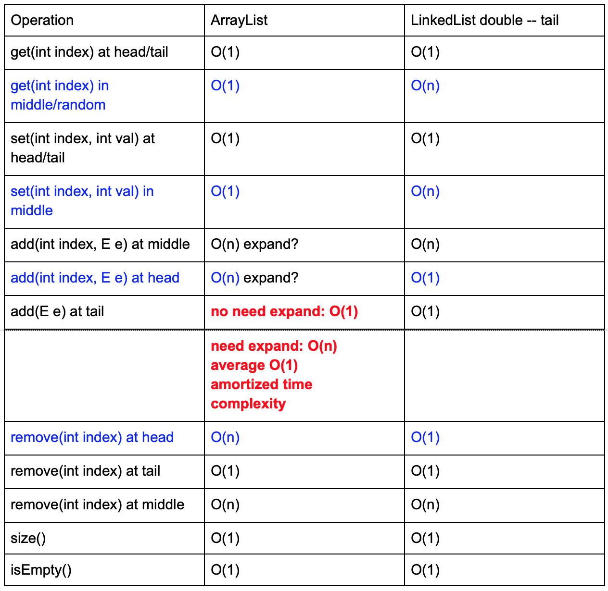
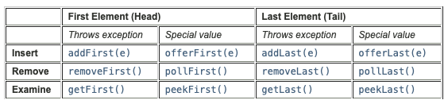

## Queue & Stack
1. 实现一个以Double Linked list为基础的list class
   - null <-> 1 2 3 4 <-> null
   - 首先先要想到要有组成linked list的ListNode
   - 一般创建一个list，```List<Integer> list = new LinkedList<>()```，这里<Integer>数据声明的是ListNode里的value的数据类型，而不是ListNode本身的数据类型，因为ListNode本身类型就是ListNode，是用来组成Linked list的基础。通常用generic泛型来传入任何类型
   - Constructor不仅仅是赋予各个field的初值，同时还要在内存中分配空间和allocate所需的reference以及其他系统的任务，因此如果要在overloading的constructor中调用之前的constructor，需要用keyword __this__，而不是相同的名字，如果是调用相同class名字的function，那只是执行了赋初值的作用，而没有allocate系统地址和空间。这里this特指本class，因为class的name和constructor name相同，这里用this表示调用本class以区别于调用constructor。
   - overloading issue：overload只会发生于input类型不一致，而不会因为output类型不同
     - overload出现在编译时，因为output只有在运行时才能知道类型，所以不会发生overload
     - given:
         - public int myMethod(int a); //会产生overload
         - public int myMethod(String a); //会产生overload
         - public int myMethod(int a, String b); //会产生overload
         - public String myMethod(int c); // 不会产生overload
   - 实现一个list，不管是用linked list或者是array来实现，外部使用的时候只关心list本身的功能，而不关心list到底是怎么实现的，也就是像是ListNode或者array这种都应该是private，透明，用户不可见的
   - 当实现double linked list，由于存在head和tail双向标识，add或者delete head要根据只有一个node和多个node两种不同情况进行处理。两种处理方法：head，tail无脑dummy node，永远有的，第二种就是分别进行判断（类似之前的preprocessing）
   - 用array实现list
     - 有个default size，要扩大的时候，可以在内存重新开辟一块更大的区域（例如2倍原来的size），然后copy原来的val过去
    ```java
    class ListNode<T> {//TODO: generic
        // fields
        T value;
        ListNode prev;
        ListNode next;

        // methods
        ListNode(T val) {
            value = val;
            next = null; // initialize null
            prev = null;
        }

        ListNode() { // constructor overloading
            this(0); // reuse之前的constructor，但是这里不能写ListNode(0)，详见上
        }
    }
    public class LinkedList<E> { 
        // fields
        private ListNode<E> head;
        private ListNode<E> tail;
        private int size;

        // methods
        //constructor
        public LinkedList() {//constructor如果标为private，则再别的class中无法new出来
            head = null; 
            tail = null; 
            // head = tail = null; 在java中是valid，自右向左，先把null赋值给tail，再把tail赋值给head
            size = 0;
        }

        public E getVal(int index) // throws Exception { 当return的val可能有意义，就throw exception
            // c.c.
            if (head == null || index < 0 || index > size - 1) {
                return -1;  // throw new IllegalArgumentsException("getVal()");
            }
            ListNode<E> cur = head;
            while(index > 0) {
                cur = cur.next;
                index--;
            }
            return cur.val; //return generic E value，而不是ListNode！
        }
        
        public void addHead(E val) {
            ListNode<E> newHead = new ListNode<E>(val); //这里new出来的ListNode两边都是接好null的
            if (head == null) {
                tail = newHead;
            } else {
                newHead.next = head;
                head.prev = newHead;
            }
            head = newHead;
            size++;
        }

        public void addTail(E val) {
            ListNode<E> newTail = new ListNode(val);
            if (tail == null) {  //说明此时head 也是null
                head = newTail;
            } else {
                tail.next = newTail;
                newTail.prev = tail;
            }
            tail = newTail;
            size++;
        }
        public int getSize() { //长治久安
            return size;
        }
    }
    ```
2. List是interface，ArrayList和LinkedList是具体实现的class
   - List的常用API
    ```java
    set(int index, E e)
    get(int index)
    add(int index, E e)
    add(E e) //末尾加入
    remove(int index)
    isEmpty()
    size()
    ```
   - Interface 内部没有field，只有声明的method，同时method没有实现
   - 任何一个class implement一个interface，这个class必须把implement的interface所有声明的method都要实现，同时这些method都是要有@override的annotation，用以覆盖interface中只声明没实现的所有method
   - 注意interface可以多继承(implement)，而class只能单继承（extend)，主要原因是父类class有可能同名method都有实现，子类不知道该用哪个；而interface由于是强制method只声明不实现，所以子类implement的method必定实现，调用也是使用这个子类实现的method
3. ArrayList vs. LinkedList
   - Resizable array，不够了需要重新找一个更大（例如两倍）的连续内存地址空间
   - ArrayList implement List这个interface，list的所有声明的method ArrayList必须都得实现
   - 随机位置add val（```add(int index, E e)```）（删除同理，linked list要找和arrayList要移）
     - ArrayList中的时间复杂度是O(1)找到index位置，O(n)插入数并shift右边的val，所以总的时间复杂度是O(n)，有可能会放满capacity，有可能要expand，expand需要O(n)，所以还是需要O(n)。如果加的位置是头，同理。
       - 但如果是在加的是在尾巴，如果capacity够用，则是O(1)，需要expand，则是O(n)，但是这个有长治久安的效应，因为expand的一次麻烦，方便了后面新的n个数字的add操作，copy原始n size的array花费的O(n)时间复杂度，就分配到未来加入的n个number，所以 用amortize的思想就是O(1)。(n + n*O(1)) / n，第一个n是expand中copy n个，第二个和第三个n是expand后一共加入的n个新element
     - Linked List中的时间复杂度是O(n)找到index位置，O(1)直接插入，所以总的时间复杂度也是O(n)。头尾都是O(1)，因为这是double LinkedList
   - ```size(); isEmpty()```由于都有了size作为field，因此ArrayList和LinkedList同为O(1)
   - ArrayList的remove tail value的操作，size--，感觉可以不用reset val
   - Prefer --> ```List<Integer> list = new ArrayList<Integer>();``` 当myMethod()是ArrayList独有的method，list.myMethod()是不valid，因为list声明为List，而List中并没有myMethod()，外界能调用的入口只有List这个interface（感觉也是interface这个名字的来源，ArrayList只是用来实现List中声明的method，List看作是个template，然后用不同的ArrayList/LinkedList来填充，多态性polymorphism）。如果要使用，可以一开始直接声明```ArrayList<Integer> list = new ArrayList<Integer>();```，亦或是做casting ```((ArrayList) list).myMethod()```
   - ```List<Integer> list = new ArrayList<Integer>();```list.add(1)，有autoboxing过程，把int 1 autoboxing 成 Integer 1。也可以手动转换，```list.add(Integer.valueOf(1));```
   - ```List<Integer> list = new ArrayList<Integer>();```，同时```List<Integer> list = new ArrayList<>();```也是valid
   - ```List<> list = new ArrayList<>();```这个传统意义上不行，但是ide也可以，能解释的原因就是由于list接收泛型，而泛型的初始为null，所以这没有给定类型的话，list就把类型设为泛型，任意初始都可以为null，__但不推荐__
   - ```List<> list = new List<>();```传统意义上不行，但是如果new的interface有default constructor，这样是valid
   - ArrayList capacity vs size，capacity就是array的length，而size是实际里面存的数值个数
   - 
   - 哪个好？怎么选择？
     - 大量随机访问 --> ArrayList
     - 大量头部操作 --> LinkedList
     - 大量尾巴操作 --> ArrayList/LinkedList
     - 大量头尾增加和删除操作 --> LinkedList
     - 大量尾巴进头部出操作 --> LinkedList
     - 内存使用效率 --> ArrayList，同为O(n) copy，array相对效率更高
4. Queue, Stack逻辑结构
   - 在JAVA中，Stack是class
     - ```Stack<Integer> stack = new Stack<>();``` 最好
     - ```List<Integer> stack = new LinkedList<>()```一般，但是能用，这里就说明stack只是逻辑结构，和实现的数据结构无关
     - ```List<Integer> stack = new Stack<>();```也可以用，因为Stack也implement list，但是API不能self explain出这是个stack
     - ```Stack<Integer> stack = new LinkedList<>()```Not valid，LinkedList不是Stack这个class的儿子
   - queue是个interface
     - ```Queue<Integer> queue = new LinkedList<>();```最好
     - ```Deque<Integer> deque = new LinkedList<>();```双向queue，这里linked list是double linked list已实现双向queue
     - ```Deque<Integer> deque = new ArrayDeque<>();```用array实现deque
     - ```Queue<Integer> queue = new Queue<>();``` Not valid
   - heap逻辑结构PriorityQueue是class，同时implement queue
     - ```PriorityQueue<Integer> heap = new PriorityQueue<>();```最好
     - ```Queue<Integer> heap = new PriorityQueue<>();```也可，但是用的是Queue的QPI
   - Deque可以适用于又是要queue又是要stack的情景，由于deque是queue的特殊版本，因此queue有的deque都有，由于queue是```Queue<Integer> queue = new LinkedList<>();```，而linked list是O(1)尾进头出，所以queue的offer是尾进，poll是头出，所以deque也有个offer和poll（除了offerfirst, offerlast, pollfirst,polllast），同样是尾进头出
5. Single Linked List同样可以实现queue和stack
   - 只要有tail的reference就可以实现尾巴进头出O(1)头尾get和remove（头进尾巴出不行，因为single linked list的tail无法得知tail.prev，所以要O(n)去找，double就没此问题），double linked list是默认有tail指针，但具独有的.prev和.next的两边方向，而single linked list只具有单边，但可以加入tail指针
   - Single Linked List同样可以实现头部进出的stack，而尾巴进出则不行
   - 所以综上如果要用single linked list用于queue和stack，直接用```List<Integer> queue/stack = new LinkedList<>()```(当然还是用相关的stack class和queue interface更好），重点是queue是尾巴进头出，而stack是头进头出，所以也要调用list相关的API，但是我们一般用Queue这个interface```Queue<Integer> queue = new LinkedList<>()```，其API的name更self explained，同时也不用去关心是头还是尾的问题了
6. 查JAVA API
   - 常见API method name，尤其是interface的
   - 相同功能的API，在input不valid的时候，一种throw exception，一种return special value（e.g. null），一般prefer后一种，如下deque API的CRUD操作
   - 
7. Queue: FIFO --> BFS --> level order traversal --> sliding window --> Dijkstra with same weight; 当带权重，就是heap
8. Stack: FILO --> DFS/Recursion --> push()pop()peek() --> implementation array, array也可以实现stack
9. constructor？
    - 有constructor
    ```java
    public class MyQueue<E> {
        // fields
        private Stack<E> stackIn; // conversion, don't put instantiate here. it doesn't make sense, even your complier will put the instantiate at the top of your constructor.
        private Stack<E> stackOut; // you can think, if static here, you will waste space

        // methods
        public MyQueue() {
            stackIn = new Stack<E>();
            stackOut = new Stack<E>();
        }
    }
    ```
    - 没有constructor
    ```java
        public class MyQueue<E> {
            // fields
            private Stack<E> stackIn = new Stack<E>();
            private Stack<E> stackOut = new Stack<E>();

            // methods

        }
    ```
    - 没有constructor同样ide可以过，这里就算没有写constructor，这里同样是在new object时候创建这两个stack，并不是在compile时创建（那个需要static修饰）
    - 如果用static创建，MyQueue仅仅在声明时（即编译时）就创建了这两个stack，同时多个MyQueue在编译时只创建了这一组stack，不同的queue share了同组stack，是万万不行的
## Q1 How to implement queue by stack (L232)
1. Description
   - 只用stack来创建queue的逻辑结构
2. Clarification
   - null
3. Follow up
   - null
### S1
1. Ideas：
   - 两个stack，offer进stack1，poll的话如果stack2是空的，先把stack1转移到stack2，然后pop stack2，如果不空直接pop
2. Comments:
   - 注意stack2，要判断空与不空的两种情况
   - code中poll和peek在invalid input return了special value null，有可能有两种情况，一种就是input invalid，还有一种就是poll出来的object本身就是null，直接//TODO throw exception
   - general rule：调用次数多的API尽量小的时间复杂度
   - 时间复杂度：
     - offer O(1)
     - poll O(1) amortized，(宏观）微观，每个element，进stackin一次，进stackout一次，O(2)
3. Code
```java
public class MyQueue<E> {
	// fields
	private Stack<E> stackIn; // conversion, don't put instantiate here. it doesn't make sense, even your complier will put the instantiate at the top of your constructor.
	private Stack<E> stackOut; // you can think, if static here, you will waste space

	// methods
	public MyQueue() {
		stackIn = new Stack<E>();
		stackOut = new Stack<E>();
    }

    public void offer(E val) {// int val
        stackIn.push(val); //boxing
    }
    public E poll() {
        move();
        return stackOut.isEmpty() ? null : stackOut.pop(); // invalid 用special value return
    }
    public E peek() {		
        move();
        return stackOut.isEmpty() ? null : stackOut.peek(); 
    }
    private void move() {// private access modifier
        if (stackOut.isEmpty()) {
            while (!stackIn.isEmpty()) {
                stackOut.push(stackIn.pop());
            }
        }
    }
}

```


