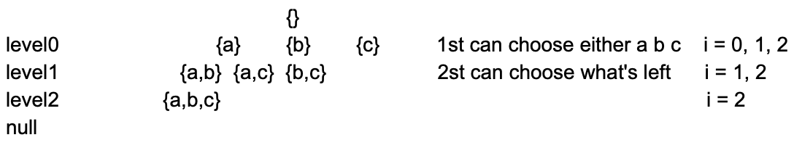
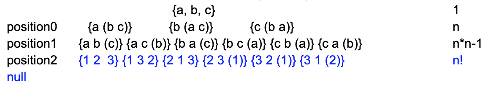

## S8 BFD & Dijkstra & DFS (backtracing)
1. All possible solution，遍历算法，两种，BFS和DFS
2. BFS和DFS相互转换
3. BFS
   - 先来后到进行遍历，neighs依次遍历，使用queue
   - 通过额外的变量记录层数步数，e.g.石头砸湖，涟漪的距离
     - 第一种方法，交替使用两个queue。当前queue所poll出的consume之后产生新的都丢到一个新的queue里，当当前的queue空了，说明这层完了，该下一层了
     - 第二种方法，标记level的最后一个val（或者第一个val）。比如标记第一个，先把第一个val标记成第一层的第一个，当tree level order traverse时，遇到标记，我们知道新的level开始了，同时立刻把这个开始的left child标记成第一个，这个left child就是下个level的第一个。但是有时候下一层的第一个可能不一定是当前第一个的left child，可能没有，right child也可能没有，比较麻烦
     - 第三个方法，使用每层的size。先把起点的size cache下来，for loop这个size，for loop 完说明第一个level结束，此时queue放进去的就是下一层的所有element，所以把这个queue的size cache下来作为新的一层的size，再次for loop从queue拿出这个size个的element，拿完说明当前level遍历完，而此时queue里又是下一层所有element，以此类推
   - BFS起点可以多个，e.g. 多个石头砸湖
   - BFS步骤：
     - step1：push root
     - step2：expand/queue.poll(), visit, print, use
     - step3: generate neighs and offer them to the queue
   - 注意while loop的终止条件？要遍历所有的话，终止条件是queue是否为空；或者其他特定条件，找到target，或者第k个什么的
4. Level order traverse Tree --> BFS
5. Dijkstra's Algorithm
   - 在一个连通无向图中，带权重的BFS寻找两点之间权重之和最小的路径
   - Dijkstra Algorithm is used to find the shortest path from one node to any other node in graph
   - 过程：
     - 
     - a点起点，到b最短距离
     - 先把a的neigh到a的最短距离更新到各个neigh中，这个最短距离就是本身a到各个neigh的权重
     - 然后在这些neigh中选个此时权重最小的，更新以这个node为基底的所有neigh的总的最短距离，注意不要更新已经选过为基底的node，也就是不要重复遍历，用visited避免
     - 然后对剩余没有作为基底的已经有了距离的中间选择最小的node再做相同更新，注意不要重复遍历
     - 最后b点更新的最短距离就是target
   - 一个node到其他所有node的最短距离，如果只求A到B，也必须把所有以A为起点到所有node的最短距离都要求出来。主要原因是到B点有多条路径，要把所有的node最小cover住，才能确定唯一的到B的最短路径
   - Best First Search or Breadth First Search with various weight, if weight identical -> BFS
   - Data Structure:
     - Heap (PriorityQueue)，拿最小值出来，虽然要更新的node在heap中，但是可以通过.neigh来dereference到neigh来改写里面的field，但这个带来一个更新问题，就是更新了neigh中的field，默认的priorityQueue不会做percolate up/down，所以需要自己写个MyHeap来实现update的功能！
    ```java
    public void dijstra(GraphNode root){
        //assume connected undirected graph
        PriorityQueue<GraphNode> pq = new PriorityQueue<>();
        Set<GraphNode> set = new HashSet<>();
        pq.offer();
        while(!pq.isEmpty()) {
            // expand poll()
            // find neis generate put into heap
            
        }
    }

    class GraphNode {
        int value;
        boolean visited; // false
        int distance; // initialize to +inf
        
        List<Pair> neis;     //Pair{GraphNode, weight} Hashmap(prefer)

        GraphNode() {

        }
    }

    public void dijkstra(GraphNode start) {
        PriorityQueue<Cell> minHeap = new PriorityQueue<Cell>(k, new Comparator<Cell>(){
            //Comparator 是interface，new出来的是个匿名class来override compare function
            @Override// lambda expression (c1, c2) -> {c1.distance - c2.distance}
            public int compare(Cell c1, Cell c2) {  
                if (c1.value == c2.value) {
                    return 0;
                }
                return c1.value < c2.value ? -1 : 1;

                return c1.distance - c2.distance; // minHeap 好记，这个局限是int，这里也可以写int里compareTo
            }
        })
    // HashSet
    }

    Heap: offer(), poll(), peek()
    ```
6. DFS
   - 适用于求所有方案，search problem, combination, permutation
   - brutal force不重复不遗漏的遍历整个所有可能的solution
   - How to solve DFS problem? Recursion / Search tree
     - how many and what is the meaning of each level? top bottom
     - how many branches for each level? left right
     - where is the answer? leaf nodes or all nodes

## Q1 Binary Tree Level Order Traversal (L102)
1. Description
   - null
2. Clarification
   - null
3. Follow up
   - Q1.1 do it by DFS
     - 使用hashmap记录key value pair，key是层数，value是该层的element所组成的一个list
       - DFS遍历过程中要记录层数，然后准备往hashmap里放：
         - 当当前层数所对应的hashmap的key value pair没有时，说明这时候遍历到的是新的层的第一个
         - 如果hashmap中有，则把这个element接到这个key层数所对应的list的后面
     - hashmap可以换成list of list，因为这里level层数就是0，1，2，直接可以对应到list的index
   - Q1.2 L107 do it by bottom up
     - 正常level order traverse，然后```Collections.reverse(result);```
   - Q1.3 L314 Binary Tree Vertical Order Traversal
     - 这里类似之前使用DFS遍历，也是建立一个vertical位置到各个node的一一对应关系
     - 所以本质上BFS也是可以在遍历过程中得到当前node的vertical位置，然后丢到hashmap中
     - 这里vertical位置可以是root为0，left child就-1，right child就加1，在遍历过程中，generate新的node时就可以根据-1和+1得到所对应的vertical level来放入hashmap
     - 如果是使用BFS，一个queue放element，一个queue放vertical位置，保证这两个queue中的内容consistent
     - 更general是把node和vertical信息 wrap到一个object中
     - 由于输出要有顺序，所以在整体的遍历过程中，要有两个global variable来记录min和max，也就是两个边界，在得到hashmap后用这两个边界来有序的输出element
   - Q1.4 Level Order Traversal from right to left
     - generate 下一层的node放入queue时，先把right child放入queue再把left child放入queue
   - Q1.5 leaf nodes order traversal
     - 输出当前leaf node，然后假设没了这些已经输出的leaf node，再次输出此时的leaf node
     - hashmap记录以当前node为root的的subtree的高度，这个高度即为leaf node输出的level，本身是leaf node的树高为1，所以应该第一个输出
     - 可以在DFS做get height的过程中，call 左右height之后，把call出来的height放进这个global的hashmap中
   - Q1.6 seeing from left or right
     - BFS level order traverse，分层for loop遍历时，当是当前层数的第一个就加到result list中，则是see from left；当是最后一个时，就加到result list中，则是see from right
     - see from top or bottom：就是vertical traverse的第一个/最后一个
### S1
1. Ideas：
   - BFS 不分层
2. Comments:
   - null
3. Code
```java
public void levelOrderTraversal(TreeNode root) { 
	if (root == null) {
		return;
    }
    Queue<TreeNode> que = new LinkedList<>();
    que.offer(root);
    while (!que.isEmpty()) {
        TreeNode pollNode = que.poll();
        //?
        System.out.println(pollNode.value); //visit 

        if (pollNode.left != null) {// 这里先判断是否是null，没有就不会加，所以从q里poll出来的永远都是非null
            que.offer(pollNode.left);// 同样，这里可以无脑都丢进去，再从q poll出consume之前判断是否是null
        }
        if (pollNode.right != null) {
            que.offer(pollNode.right);
        }
    }
}
```
### S2
1. Ideas：
   - BFS 分层
2. Comments:
   - null
3. Code
```java
public List<List<Integer>> level(TreeNode root) {
	List<List<Integer>> result = new ArrayList<List<Integer>>();
	if (root == null) {
		return result;
    }
    Queue<TreeNode> queue = new LinkedList<TreeNode>();

    queue.offer(root);
    while (!queue.isEmpty()) {
        int size = queue.size(); //一定要cache下来这个size，不能在for loop statement里动态调整size
        List<Integer> list = new ArrayList<Integer>();
        for (int i = 0; i < size; i++) {
            TreeNode node = queue.poll();// offer, poll, peek
            list.add(node.val);
            if (node.left != null) {
                queue.offer(node.left);
            }
            if (node.right != null) {
                queue.offer(node.right);
            }
        }
        result.add(list);
    }
    //Collections.reverse(result);  
    return result;
}
```
## Q2 L103 Binary Tree ZigZag Level Order Traversal
1. Description
   - 第一层，从左到右；第二层，从右向左；第三层，从左向右；...
2. Clarification
   - null
3. Follow up
   - Q2.1 能被三整除的行，从左向右打印
     - 使用level判断从左到右或是从右向左
   - Q2.2 what if print out null
### S1
1. Ideas：
   - tree level order traverse分层遍历
   - 加入一个boolean表示是从左向右还是从右向左
     - 从左向右，直接把当前的list加入
     - 从右向左，把当前的list reverse之后在加入result list
2. Comments:
   - null
### S2
1. Ideas：
   - 两个stack，一个stack是当前level正在遍历的element，一个stack放下一层的预备遍历的element
2. Comments:
   - 正向从左到右遍历正在用的stack，pop出来的element加到result中，同时先把left child加入下层的stack，再right child
   - 反向从右到左遍历正在用的stack，pop出来的element加到result中，同时先把right child加入下层的stack，再left child 
### S3
1. Ideas：
   - deque + level order traverse 分层遍历
2. Comments:
   - 从左向右则像level order traverse正常左边出右边进
   - 当要从右向左输出时，则是右边出左边进，同时是先把right child从左边进，然后再是left child 左边进
   - 这里奇数层从左向右，偶数层从右向左，如何在level order traverse各个level中不断切换？
     - boolean flag，只能表示两层
     - 0和1，flag = 0，flag = 1 - flag，只能表示两层
     - level直接看奇偶，可能level过深，所以level %= 2避免level++越界
3. Code
```java
public List<List<Integer>> level(TreeNode root) {
	List<List<Integer>> result = new ArrayList<List<Integer>>();
	if (root == null) {
		return result;
    }
    Deque<TreeNode> queue = new LinkedList<TreeNode>();

    queue.offerLast(root);
    boolean flag = false;
    while (!queue.isEmpty()) {
        int size = queue.size();
        List<Integer> list = new ArrayList<Integer>();
        for (int i = 0; i < size; i++) {
            if (flag == false) {
                TreeNode node = queue.pollFirst();// offer, poll, peek
                list.add(node.val);
                if (node.left != null) {
                    queue.offerLast(node.left);
                }
                if (node.right != null) {
                    queue.offerLast(node.right);
                }
            } else {
                TreeNode node = queue.pollLast();// offer, poll, peek
                list.add(node.val);
                if (node.right != null) {
                    queue.offerFirst(node.right);
                }
                if (node.left != null) {
                    queue.offerFirst(node.left);
                }
            }
        }
        flag = !flag; flag = 1 - flag;
        result.add(list);
    }   
    return result;
}
```
### S1 Q2.2
1. Ideas：
   - Tree level order traverse 不分层 print null
2. Comments:
   - null
3. Code
```java
public void levelOrderTraversal(TreeNode root) { 
	if (root == null) {
		return;
    }
    Queue<TreeNode> que = new LinkedList<>();
    que.offer(root);
    while (!que.isEmpty()) {
        TreeNode pollNode = que.poll();
        //?
        if (pollNode != null) {
            System.out.println(pollNode.value); //visit 
            que.offer(pollNode.left);
            que.offer(pollNode.right);
        } else {
            System.out.println("null");
        }
    }
}
```
## Q3 Validate a complete binary tree
1. Description
   - null
2. Clarification
   - null
3. Follow up
   - null
### S1
1. Ideas：
   - level order traverse，只要遇到null后面不能出现非null的element，否则就不是complete binary tree
2. Comments:
   - 不分层level order traverse print null
   - 有null可以设个flag为true
3. Code
```java
public boolean isCompleteBT(TreeNode root) { 
	if (root == null) {
		return;
    }
    Queue<TreeNode> que = new LinkedList<>();
    boolean flag = false;
    que.offer(root);
    while (!que.isEmpty()) {
        TreeNode pollNode = que.poll();
        //?
        if (pollNode != null) {
            if (flag == true) return false;
            que.offer(pollNode.left);
            que.offer(pollNode.right);
        } else {
            flag = true;
        }
    }
    return true;
}
```
### S2
1. Ideas：
   - level order traverse，不分层
2. Comments:
   - 通过check parent的child是否是null来set flag
3. Code
```java
public boolean isCompleteBT(TreeNode root) { 
	if (root == null) {
		return;
    }
    Queue<TreeNode> que = new LinkedList<>();
    boolean flag = false;
    que.offer(root);
    while (!que.isEmpty()) {
        TreeNode pollNode = que.poll();

        if (pollNode.left != null) {
            if (flag == true) return false;
            que.offer(pollNode.left);
        } else {
            flag = true;
        }
        if (pollNode.right != null) {
            if (flag == true) return false;
            que.offer(pollNode.right);
        } else {
            flag = true;
        }
    }
}
```
### S3
1. Ideas：
   - 先level order traverse遍历非null，记录最后一个非null的index
   - 再level order traverse遍历包含null的最后一个非null的index
   - 两者应该一致，否则不是complete binary tree
2. Comments:
   - null
## Q4 Check whether a given graph is Bipartite or not (L785)
1. Description
   - http://www.geeksforgeeks.org/bipartite-graph/
   - 两个group之间有边，group内部无边，则称为可以bipartite
2. Clarification
   - 是不是联通的？
   - 是不是无向边？
   - input是不是cover所有各个非连通的graph？
   - 有没有cycle？
   - graph的表示方法？是GraphNode object还是用matrix？
3. Follow up
   - null
### S1
1. Ideas：
   - level order traverse涂color，neigh涂成第二个color，放进q，准备下次涂色，如果冲突，则return false
2. Comments:
   - 有cycle的话，涂过颜色的并第一次塞进queue之后，把visited field设为true，避免之后重复遍历，这里color可以代替visited的功能，涂了颜色并第一次塞进q就是visited过了
## Q5 Graph traversal
1. Description
   - 2D matrix的graph
2. Clarification
   - Graph各种clarify
3. Follow up
   - Q5.1 L286 Shortest Path in Simple Graph
   - Q5.2 Graph BFS vs Tree BFS
## Q6 find the kth smallest elements.
1. Description
   - 左右升序，上下升序
   - [
        [1,   4,  7, 11, 15],
        [2,   5,  8, 12, 19],
        [3,   6,  9, 16, 22],
        [10, 13, 14, 17, 24],
        [18, 21, 23, 26, 30]
     ]
2. Clarification
   - 有序？
   - 如何有序？从上到下，从左到右，下面的每一行都比上面的大？
   - 何为smallest？
3. Follow up
   - Matrix find path or find path sum (L378)
### S1
1. Ideas：
   - BFS with weight，priorityQueue
2. Comments:
   - 过程：
     - Start：matrix[0][0]
     - Expand/Generate: expand[i][j] --> [i+1][j]和[i][j+1]
     - Termination: kth element, PriorityQueue poll() kth time
     - Deduplicate：value不影响结果，位置会影响，查重用hashset，或者建一个相同size的boolean matrix来check visited，空间占用大
       - 当使用hashset去位置重复，使用放row和col的2 size的List<Integer>可以，因为list改写了compare函数，比较的不是reference。而是里面的值，int[2]和把2个坐标wrap成class的Point默认都是比较reference，而不是里面的值，需要改写compare函数
       - 可以手动hash，也就是```i*matrix[0].length + j```，或者```j*matrix.length+i```
   - 时间复杂度：一共看k次，每次出一个进2个到heap中，3次logk操作在heap中，所以是k*（3*logk)，是klogk
   - 空间复杂度：k + min(m+n-1, k)
     - priorityqueue是出一个进两个，找寻最小第k个，所以是O(k+1)，最后一次进两个所以+1。
     - 查重的空间：hashset是有多少个进了heap的，就得有多少进hashset，凡是进了heap的都是已经visited过了，每次往右和下，进两个，有k次，进最多2k个，所以是O(2k)。但是由于heap poll出来的之后永远不会遇到，也就不会遇到查重的问题，所以这部分poll出来的可以从hashset中删去，所以空间复杂度不会到2k，还是O(k) level，这时的最差情况就是m+n-1，因为只保留每行最后一个和每列最后那个，而k是最大值就把所有matrix都遍历了，其实就是整个matrix的最后一行和最右边一列。综上，是min(m+n-1, k)
## Q7 Subsets (L78)
1. Description
   - without duplicates
   - not sorted
2. Clarification
   - BFS vs. DFS
     - 很宽的树，推荐DFS。如果在很宽的树用bfs，会outofmemory
     - 很高的树，推荐BFS。如果在很高的树用dfs，会stackoverflow
3. Follow up
   - null
### S1
1. Ideas：
   - 按照每个subset的个数来不重复不遗漏的方法遍历
2. Comments:
   - 
   - 每个set分几个叉？站在当前位置在原来的input中往右for loop的所有的数，当前位置是上一层传下来的index
   - 而上一层要传的下层的位置index是当前的index+1
   - 这个搜索树的每个node都是答案
   - 使用StringBuilder，add和remove
   - 由于每次需要之前的result，所以往下call的时候要传之前的所有result
   - 由于是先办事再call，每个节点都是答案，所以return的是void
   - 要做backtracing
   - Stringbuilder的使用，O(1)时间append
   - 当前结果往所有的result加的时候是deep copy
   - backtracing用什么？
     - deleteChatAt和remove都是给定要删的index，setLength是set原始的sb到固定length
     - 各有各的好处，比如如果之前append是多个char，setLength会好一点
     - 这里是使用stringbuilder，所以每次是确确实实append到后面，要backtracing remove
     - 如果是使用string，dfs传入的是string+current char的形式，由于string 本身是immutable，使用+直接new一个新的string，所以原始的string不会改变，所以不用做backtracing
3. Code
```java
private void dfs(char[] array, int index, StringBuilder sb, List<String> res) {
	res.add(sb.toString()); // deep copy
	// base case是 index == array.length 则return，这里吸收到for loop里了
    for (int i = index; i < array.length; i++) {
        sb.append(array[i]); "1-->2-->3"
		dfs(array, i+1, sb, res);  sb → str
		//
		sb.deleteCharAt(sb.length() - 1) // remove / setLength()
	}
	//
}
```
### S2
1. Ideas：
   - 对于每个element做取和不取的组合
2. Comments:
   - 
   - result出在所有的leaf node，因为要把所有element判断完要取还是不取
   - 走到index==arr.length时，说明都问过所有element取还是不取，这就是base case，base case一定要return！
   - 每个element分两叉，即取这个element还是不取，所以可以不用for loop
   - 这里backtracing时，不只是同层，还有往上层的backtracing，也就是说不能先不取，然后取完不deleteCharAt，因为这里虽然同层没有问题，但backtracing返回上层时就有问题了
3. Code
```java
private void helper(char[] array, int index, StringBuilder sb,List<String> result){
    // if we decide on all positions
    // we have a complete subset, all subset locate on the leaf node
    if (index == array.length) {
        result.add(sb.toString()); // deep copy  arr.clone()
        return;
    }

    // case1. add character at index;
    sb.append(array[index]);
    helper(array, sb, index + 1, result);

    // wall
    // remove the added character when backtracking to the upper level
    sb.deleteCharAt(sb.length() - 1); // backtracing

    // case2. NOT add character at index
    helper(array, sb, index + 1, result); 
}
```
### S3
1. Ideas：
   - 类似S2取和不取，使用BFS
2. Comments:
   - 先把空StringBuilder丢到queue里
   - 把空sb从q中poll出来，然后分别建立两个新的sb，一个是取element，一个是不取，把这两个sb丢到q里
   - 再把q里的都取出来，取和不取，都做好了，个数翻倍，再offer回q中
   - while跳出条件是把原始input的所有element都问过取还是不取时，此时offer回q中的所有就是target subset
   - 这里BFS就是S2中的搜索树的level order traverse的过程
### S4
1. Ideas：
   - 类似S1，使用BFS
2. Comments:
   - 这里做类似S1中搜索树的level order traverse，同时这里每个node都是答案
   - 而for loop时是站在当前位置往后看，所以当前的index很重要
   - 先把空{}丢到result list中
   - q中offer -1
   - 把-1拿出来，在-1看所有element，for loop所有element，把loop到的每个element加到这个空sb中冰create新的sb
   - 把每次loop的element的index做成一个list，加到q中
   - 然后从q中先poll一个index list
   - 在这个index list的最大的index的element往后看，for loop，先把element加到当前element list所组成的subset中，放到result里
   - 再把加进来的element的index加到当前index list后面offer进q中
## Q8 L22 Generate Parentheses
1. Description
   - Given n pairs of parentheses, write a function to generate all combinations of valid parentheses
2. Clarification
   - null
3. Follow up
   - Q2.1 L20 Valid Parentheses
     - 使用stack
### S1
1. Ideas：
   - DFS，取还是不取分叉
2. Comments:
   - 所以所有combination的可能性出现在leaf node
   - 一种方法是把这所有的combination都求出来，然后再对这所有的combination做valid parenthese。但是时间复杂度很高
   - 可以提前剪枝，在recursion过程中，可以传两个var，分别是左括号和右括号的数量
   - 还有就是这里n pair，有n个左括号和n个右括号，当左括号加了n个之后，左括号就不能再加了，也是剪枝的另一个条件
   - 所以左括号的条件是此时左括号的个数小于n
   - 而添加右括号的条件是其个数小于n，还得使得加了的右括号总数不大于左括号的总数
   - 当左括号的总数加右括号的总数等于2n，说明到底了，可以加到result list里
   - ```'a'```是char，```"a"```是string
3. Code
先剪枝，再recursion call
```java
private void DFS(int n, int l, int r, StringBuilder sb, List<String> res) {
	// base case
	if (l + r == 2*n) {
		res.add(sb.toString());
		return;
	}
	if (l < n) {
	    sb.append(‘(’); // "" '' or anything
	    DFS(n, l + 1, r, result, sb);
        sb.deleteCharAt(sb.length() - 1); // remove() setLength
    }
    if (r < l) {
        sb.append(‘)’);	
        DFS(n, l, r + 1, result, sb);
        sb.deleteCharAt(sb.length() - 1);
    }
}
```
先recursion call，再剪枝
```java
private void dfs(List<String> res, StringBuilder sb, int n, int left, int right){
	//success
    if(left == n && right == n) {
        res.add(sb.toString());
        return;
    }
	//failure 
    if (right > left || left > n) {
        return;
    }
    //'('
    int len = sb.length();
    sb.append('(');
    dfs(res, sb, n, left + 1, right);
    sb.setLength(len);
    // ')'
    sb.append(')');
    dfs(res, sb, n, left, right + 1);
    sb.setLength(len);
}

```
## Q9 Combination (L77) Combination Sum I II III IV (L39 L40 L216 L377)
1. Description
   - null
2. Clarification
   - null
3. Follow up
   - Q3.1 coins sum up to target
### Q3.1 S1
1. Ideas：
   - 使用DFS
2. Comments:
   - 每次加入一种币值，for loop从加0个，到可以加的最大个数
   - 加好了，把target - 这次加的数传到下一个recursion call
   - 再for loop新的币值得可以加的个数
   - base case是remaining为0，return
   - 因为这里最后的币值是1，也可以只check到倒数第二个币值，剩下多少就是有多少币值是1的加入，所以可以少一个level
   - 如果是最后币值是2，就可以分两种base case情况讨论
   - 这里是每层对单个币值取不同个（动态），层数是币值的类别个数（固定）。也可以每层是取所有币值中的一个（固定），层数是最多能取几个币（动态）
3. Code
```java
void dfs(int[] coins, int level, int left_balance, int[] sol, List<int[]> res) {
	// base case
	if (level == coins.length - 1) {
		sol[level] = left_balance; // sol[3]
		// add sol to res → deep copy
		// res.add(sol); // wrong
		int[] newSol = new int[sol.length];
		for (int i = 0; i < sol.length; i++) {
        	newSol[i] = sol[i];
        }
	    res.add(newSol); // or clone(); res.add(sol.clone()); copyof
		return;
	}
	int num = left_balance / coins[level] + 1;
	for (int = 0; i < num; i++) {
		sol[level] = i;
		dfs(coins, level + 1, left_balance - i * coins[level], sol, res);
		sol[level] = 0; // can be removed because assign, backtracing
	}
}
```
## Q10 Permutation (L46)
1. Description
   - Given a collection of distinct numbers, return all possible permutations.
2. Clarification
   - null
3. Follow up
   - null
### S1
1. Ideas：
   - dfs+交换
2. Comments:
   - 每次取for loop从当前index 位置往右看到尾部，选定一个和当前index位置的element交换（自己也可以和自己交换）
   - 交换完，往下recursion同时传的是swap位置的那个index+1，也就是原始上一次传入的index，而不是i！
   - result出在leaf node
   - 注意array转string
     - ```new String(array); "123"```
     - ```String.valueOf(); "123"```
     - ```Arrays.toString();  // 反例 "[1,2,3]"```
   - 时间复杂度：
   - 
   - 1 + n + n(n-1) + ... + n!
1. Code
```java
private void dfs(char[] array, int index, List<String> res) {
	// base case
	if (index == array.length - 1) [
		result.add(new String(array));
		return;
	}
	for (int i = index; i < array.length; i++) [
		// a
        swap(array, index, i);
		dfs(array, index + 1, result);
		swap(array, index, i); // backtracing
		// a
	}
	// return
}
```