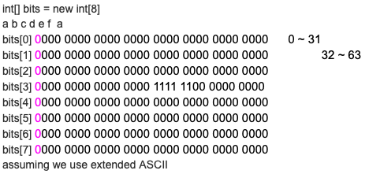

## S9 Bit & Number & Math
1. What int a = 1 is represented in binary and store in memory?
   - 32 bits = 4 Bytes --> storage
   - most significant bit or sign  0000 0000 0000 0000 0000 0000 0001 0001   least significant bit
   - 上面是左边大端，右边小端；也有左小右大的机器表示方法
   - 同时在java中最大端第一个是符号位，0为正，1为负，no unsigned keyword for java
   - 如果是非符号位，一共有2^32种可能，所以可以表示0 ~ 2^32-1
2. 如何讲二进制与十进制相互转换？
   - 2 --> 10: 2的n次方的加权求和（任意进制到10同理）
   - 10--> 2: 不断除以2取余
     - e.g. 17 --> 10001
     - 17 / 2 = 8 … 1 （最右端
     - 8 / 2 = 4 … 0
     - 4 / 2 = 2 ...0
     - 2 / 2 = 1 .. 0
     - 1 / 2 = 0 .. 1 （较大的端，权重最大，自下向上
   - 任意进制到任意进制：先转到10，再从10转化到target
3. 和为0的两个数成为互为补码，也就是相反数
   - 二进制求补码，取反加一，这个是相互的，正到负和负到正都可以取反加一得到
   - e.g. 2
     - +2	0000 0000 0000 0000 0000 0000 0000 0010
     - -2	1111 1111 1111 1111 1111 1111 1111 1110
     - 负数二进制到十进制时，第一位的权重是-2^32，即：
       - -2^31+2^30+2^29+2^28+2^27+2^26+2^25+2^24+2^23+2^22+2^21+2^20+2^19+2^18+2^17+2^16+2^15+2^14+2^13+2^12+2^11+2^10+2^9+2^8+2^7+2^6+2^5+2^4+2^3+2^2+2^1+0*2^0
     - 反之，如果符号位是0，则就是0*2^31
   - 正数越小，左边0越多；负数越小，左边1越多
   - 二进制的除以2，带符号位右移；乘以2，带符号位左移
   - 0的补码是自己
   - 负数最大（-2^31)的补码并没有
4. Integer范围
   - 最大：2^31-1 (0111 1111 1111 1111 1111 1111 1111 1111) 第一位固定0，后面31个位置，每个位置两种取值，去掉全是0是0不是正数的情况
   - 最小：-2^31  (1000 0000 0000 0000 0000 0000 0000 0000)第一位符号位固定1，后面31位数，两种取值，这里不用去掉全是0的情况，所以是-2^31
   - 0和正数的个数=负数的个数，0的补码是自己，负数最大（-2^31)的补码并没有
5. Bit操作
   - ```&```bit and
     - bit形式求and
     - 9 & 5 = 9(1001) & 5(0101) = 1(0001)
   - ```|```bit or
     - 9 | 5 = 9(1001) | 5(0101) = 13(1101)
   - ```~```bit not
     - ~9(0...0 1001) = (1...1 0110)
   - ```^```bit XOR "exclusive or"
     - 9 ^ 5 = 9(1001) | 5(0101) = 12(1100)
     - a ^ a = 0
     - 0 ^ b = b
     - 符合交换律和结合律
   - ```<<``` left shift
     - x = 2 x<<2
     - 0010 --> 1000
     - 注意 x<<2时，x依旧是2；要 x = x<<2（或者 x <<= 2）才能赋值到x上
     - 左移一位，相当于乘以一个2，不管是负数或者正数都满足
   - ```>>```
     - 带符号位右移
     - 如果符号位是1，则右移后左边补1；如果符号位是0，则补0
     - 可以实现右移一位，相当于除以2，不管对于负数正数都满足
     - 1100 >> 2 --> 1111
     - 0100 >> 2 --> 0001
   - ```>>>```
     - 右移后左边无脑补0
     - 这种是只care bit number中1的个数，不在乎原本数字的大小正负关系
     - 1100 >>> 2 --> 0011
   - 时间复杂度都是O(1)
6. set index k bit to 1 of int x?
   - k是bit number从右边数index k（0 base）
   - x | (1 << k)
   - 1 << k --> mask
   - e.g.
   - 1010 0101 x, k = 4
   - 1011 0101 result
7. set index k bit to 0 of int x?
   - x & ~(1 << k)
   - e.g.
   - 1011 0101 x, k = 4
   - 1010 0101 result
8. check kth bit is 1 of int x?
   - x & (1 << k) 看这个是不是0，是0则这个位置是0，不等于0则这个位置是1
   - (x >> k) & 1 看这个是1还是0，1就是说明这个位置是1，0说明这个位置是0
   - e.g.
   - 1011 0101, x check k = 4
   - 0001 0000, 1 << k
   - 0000 1011, x >> k
   - 0000 0001, 1
9. check kth bit is 0 of int x?
   - 对“check kth bit is 1 of int x?”取反
   - x & (1 << k) 看这个是不是0，是0则这个位置是0，不等于0则这个位置是1
   - (x >> k) & 1 看这个是1还是0，1就是说明这个位置是1，0说明这个位置是0。这个就是get了这个位置是1还是0
10. toggle the kth bit
    - 对x的第k位取反
    - x ^ (1 << k)
11. Hashset查重：
    - 有限size（例如26个字母）可以使用boolean []优化，用index表示各个char
    - 进而可以使用32位bit number进一步优化空间复杂度
## Q1 Number of 1 bits (L191)
1. Description
   - Write a function that takes an unsigned integer and returns the number of ’1' bits it has (also known as the Hamming weight)
   - For example, the 32-bit integer ’11' has binary representation 00000000000000000000000000001011, so the function should return 3
2. Clarification
   - null
3. Follow up
   - null
### S1
1. Ideas：
   - mask 1左移去check 32个位置是0还是1，是1就count++
2. Comments:
   - null
3. Code
```java
public numOfBits(int n) {
	int count = 0, mask = 1;
	for (int i = 0; i < 32; i++) {
		if ((n & mask << i) != 0) count++;
		// mask <<= 1; 时间复杂度一样的，因为不管左移几位都是O(1)操作
	}
	return count;
}

```
### S2
1. Ideas：
   - 可以input右移32次，去和1且操作，是1就count++
2. Comments:
   - 是>>还是>>>并不非常重要，因为只右移32位，补的都右移不到最右边，卡住了
   - 但是由于如果使用>>>无脑补0时，有可能还没移完32位的时候，这时已经全是0了，也就是可以check当前移了的数是否为0来实现提前结束  
3. Code
```java
public int numOfBits(int n) {
	int count = 0;
	for (int i = 0; i < 32; i++) {
		if ((1 & n) != 0) count++;
		n >>>= 1; // >>=? to hw
	}
	return count;
}

public int check ( int n ){
	int count = 0;
	while ( n != 0 ){ // 提前结束
		if ( (n & 1) != 0) count++;
		n >>>= 1;
}
	return count;
} 
```
## Q2 Single number (L136)
1. Description
   - Given an array of integers, every element appears twice except for one. Find that single one.
2. Clarification
   - null
3. Follow up
   - Q2.1 check different bit between two numbers if same XOR = 0, different XOR = 1
   - Q2.2 -2进制加法
### S1
1. Ideas：
   - 异或所有数字
2. Comments:
   - xor满足交换律和结合律
## Q3 Power of Two (L231)
1. Description
   - Given an integer, write a function to determine if it is a power of two
2. Clarification
   - null
3. Follow up
   - Power of Three/k
     - S1和S3可以做power of 3
     - 对于power of 4：
       - S2是两个两个check是不是1，而S4不行
### S1
1. Ideas：
   - recursion，不断地除以2，直到得到1，或者余数不为0
2. Comments:
   - 这里是先除以2，在recursion call，尾部递归比较容易转换成while loop
   - 同时，也可以用DP，从1不断地乘以2，乘以2注意会越界
3. Code
```java
//power of two recursion
public boolean powerOfTwo(int n) {
	// Corner Case
	if (n <= 0) {
	    return false;
    }
    // Base Case
	if (n == 1) {
	    return true;
    }
    // 
    if (n % 2 != 0) {
        return false;
    }
    return powerOfTwo(n / 2);
}

public powOf2(int n) {
	//int rem = 0;
    while (n > 1) {
		if (n % 2 != 0) return false;
		n /= 2; 
	}
	return n == 1;
}

public boolean isPowerOfTwo(int n) {
    int mask = 1; // long, int 会 overflow
    while(mask < n){
        mask *= 2; // mask <<= 1
    }
    return mask == n;
}
```
### S2
1. Ideas：
   - hamming weight等于1，同时符号位必须是0
2. Comments:
   - null
### S3
1. Ideas：
   - find the maximum power of two that can be represented by integer or long, then divide by the number to test， if reminder is 0, then the number is the result
2. Comments:
   - 2^30：0100 0000 0000 0000 0000 0000 0000 0000
   - 2 * 2 * 2 * 2 ….  * 2 * 2 * 2 = Max_Pow2
### S4
1. Ideas：
   - target - 1与target做一个bit and操作，操作完结果是0则是power of two，不是0则不是power of two
2. Comments:
   - 如果不是power of two，那么其bit 表示形式至少有两个1，在减1之后，最右边那个1和后面的0 flip操作，而前面的那个1依旧保留，所以如果再取bit and，前面的1依然保留，所以bit and完的数不等于0
## Q4 No duplicate character in word --> string array (L217 219 220)
1. Description
   - does duplicate char exist in a char array
   - does duplicate string exist in a string array
   - http://www.lintcode.com/en/problem/unique-characters/ 
2. Clarification
   - null
3. Follow up
   - null
### S1
1. Ideas：
   - hashset
2. Comments:
   - 空间复杂度取决于原来的array中unique element的个数
   - 如果unique element个数有限，可以用一个有限长度的boolean array
   - 同理如果用hashmap作统计，key的size也是取决于其unique element的个数
   - 而且使用hashset或者hashmap不用提前开辟26个位置，而用boolean array要提前分配size是26的array空间
   - 但是array的查找效率远高于hashmap，同时array已经sort好的特性，hashmap没有有序的特点
### S2
1. Ideas：
   - trie
2. Comments:
   - null
### S3
1. Ideas：
   - 使用8个bit int
2. Comments:
   - 当使用boolean array优化hashset时，进而使用32位的bit number int来优化
   - Extended ASCII table 256位，8个32位的bit number int
     - char之间的数学运算是ASCII table的Dec index之间的操作
     - 数字在大写之前，大写在小写之前
   - 256: （4个256就是一个32位bit int）
     - rgba: 0~255, 0~255, 0~255, 0~255，4个group，每个group 8 bit，所以可以用8个32位的bit number int表示一个r
     - ip: 0~255.0~255.0~255.0~255
   - extend ASCII，表示不下，使用Unicode -> utf-8 charset
   - 
3. Code
```java
public boolean checkUnique(char[] chars){
    try{
        if (chars == null || ) {
                throw new IllegalArgumentException("msg say sth");
                //如果要return null，function signature中的boolean要改写成Boolean
            }
	    // corner case passed
        int[] bitSet = new int[8];
        for (char c : chars) {
            int i = c / 32; // cache temp     
            int j = c % 32; // matrix coordinate match
            if ((set[i] & (1 << j)) != 0 ) return false; // use left shift to avoid x modification, always use != 0 to check thus avoid potential bugs. x >> k
            else x |= 1 << j
        }
        return true;
    } catch (IllegalArgumentException e) {
        // do some exception handing here
        System.out.println(e.getMessage());
        e.printStacktrace();
        Logger.log(e); // Singleton
    } catch (Exception e) {
        // do sth
    }
}
```
## Q5 Reverse Bits (L190)
1. Description
   - null
2. Clarification
   - null
3. Follow up
   - Q5.1 Reverse Integer, 10进制/7, 5, 3, 2进制， double※ 12.345 → 543.21
   - Q5.2 Reverse String
   - Reverse array --> swap, O(1)随机访问
   - Reverse linked list --> recursion，不能O(1)时间随机访问
### S1
1. Ideas：
   - 从右向左遍历input bit number，check 0 or 1，从左向右填target的bit，set 0 or 1
2. Comments:
   - 注意input中for loop的index的位置，以及target要填的位置（31-i)
   - 不是inplace操作
3. Code
```java
public int reverseBits(int n) { 
	// corner case all 0 or all 1
	int res = 0;
	for (int i = 0; i < 32; i++) {
		int temp = (n >> i) & 1;
		res |= temp << (31 - i)
	}
	return res;
}
```
### S2
1. Ideas：
   - 双边访问swap，inplace操作reverse bits
2. Comments:
   - 两边访问的pointer之间有关系，加和是31，所以如果右边低位是index i, 左边高位就是 31-i。
   - 同时，两个只要走到中间就行，只要走一半，也就是从 i = 0 走到 i = 15 步
   - 同时，如果左右访问的值不一样才会swap
   - bit 的swap：由于已经在之前判断这两个要交换的值肯定不一样，非0即1，所以两个各自取反同时保证其他的不变。使用xor
3. Code
```java
public int reverseBits(int n) {
	// corner case
	for (int i = 0; i < 16; i++) {
        // get left and right bit value
		int left = 1 & (n >> (31 - i));    //1000   vs   NO mast left shift   0001 0000
        int right = 1 & (n >> i) ;	    //0001
        if (left != right) { // XOR
            n ^= 1 << (31 - i);
            n ^= 1 << i;
        }
	}
	return n;
}
```
### Q5.1 S1
1. Ideas：
   - 使用取余的方法拿到每一个digit，然后result = result * 10 + digit
2. Comments:
   - integer overflow，最大最小都要check，比如最大是2^31 - 1 = 2,147,483,647，十位input的个位大于7在reverse后就会出现int overflow。
   - 因为只有可能在把input是10位且在最后一位加到result后时会发生，所以只要这个操作下check
   - 在这一步中，可以让（2^31 - 1）/10和当前9位的result比较，result小，就可以加；result大，就会overflow；result相等，还得check这个要加的最后一位和2^31 - 1中的7的关系，小于等于可以加，大于就不行
   - input还可以为负数，在java中，负数除法和取余等于去掉负号的正数，python或者js就不行
   - reverse by any 进制时，把10，7那些赋值成weight用于推广
3. Code
```java
public int reverseInteger(int n) {
	// sign
    int res = 0;
	while(n != 0) {
		// check 最后一位是否overflow
		res = res * 10 + n % 10; // 以七进制reverse：res = res * 7 + n % 7;
        // 以二进制reverse：res = res << 1 + n & 1
		n /= 10; // 以七进制reverse：n /= 7;
        // 以二进制reverse：n >>= 1
	}
	return res;
}
```
## Q6 x进制转换 二进制 十进制 十六进制
1. Description
   - 2进制的表示形式：```int num = 0b1011```
   - 16进制：0xa4e7，使用string来表示
   - 十进制到x进制：对x取余，除以x，再对除以x之后的结果取余，把得到取余的结果reverse就是x进制表示形式
   - x进制到十进制：x^0, x^1, x^2, 加权求和
   - x进制到y进制：以十进制为桥梁
2. Clarification
   - 注意正负情况
3. Follow up
   - Q6.1 how to make it universal or like a module/library
### S1
1. Ideas：
   - 10进制转为16进制
2. Comments:
   - 使用string表示16进制的结果
   - 需要一个char array来表示16进制中的0-9和a-f，同理罗马数字也是要这个类似的char array
   - StringBuilder append时间复杂度是O(1)，但是insert（插入在最前面）的时间复杂度是O(n)
3. Code
```java
char[] hexSympol = {'0' , '1',..., 'd', 'e', 'f'};
public String toHex(int n) { 
	String result = "";
	while (n != 0) {
		result += hexSymbol[n % 16]; // result = hexSymbol[n % 16] + result
        n = n / 16;
    }
    result = reverse(result);
    return "0x" + result;
}

```java
public String decToHex(int n){
	if(n == 0) return “0”;
    StringBuilder sb = new StringBuilder();
	char[] hexSympol = new {....};
	while(n != 0){
		sb.append(hexSympol[n%16]); // sb.insert(0, hexSympol[n%16])
		n /= 16;
}
return sb.reverse().toString()
}
```
## Q7 Integer to Roman (L12, L13)
1. Description
   - null
2. Clarification
   - null
3. Follow up
   - null
### S1
1. Ideas：
   - null
2. Comments:
   - null
3. Code
```java
public String intToRoman(int num) {
	String[] strs = {"M", "CM", "D", "CD", "C", "XC", "L", "XL", "X", "IX", "V", "IV", "I"};
	int[] numbers = {1000, 900, 500, 400, 100, 90, 50, 40, 10, 9, 5, 4, 1};
	StringBuilder sb = new StringBuilder();
	int i = 0;
	while (num > 0) {
		while(num >= numbers[i]) {
			sb.append(strs[i]);
			num -= numbers[i];
		}
		i++;
	}
	return sb.toString();
}
```
## Q8  Divide Two Integers
1. Description
   - Divide two integers without using multiplication, division and mod operator.
   - If it is overflow, return MAX_INT
   - 计算机底层运算都是二进制运算
2. Clarification
   - null
3. Follow up
   - null
### S1
1. Ideas：
   - 确定target中的能小于被除数的最大的power of two的权重
2. Comments:
   - 时间复杂度：logn，反向使用binary search
3. Code
```java
public int divide(int dividend, int divisor) {
	if (dividend == Integer.MIN_VALUE && divisor == -1) return Integer.MAX_VALUE;

	long p = Math.abs((long)dividend);
	long q = Math.abs((long)divisor);

	int result = 0;
	while (p >= q) {
		int shift = 0;
		while (p >= (q << shift)) {
			shift++;
		}
		result += 1 << (shift - 1);
		p -= q << (shift - 1);
	}
	if (( dividend > 0 && divisor > 0) || (dividend < 0 && divisor < 0)) return result;
	else return -result;
}
```
## Q9 Sqrt(x) (L69)
1. Description
   - null
2. Clarification
   - null
3. Follow up
   - null
### S1
1. Ideas：
   - null
2. Comments:
   - null
3. Code
```java
public int sqrt(int x) {
	if (x <= 1) return x;
	double f0 = x/2;
	double f1 = (x/f0 + f0) / 2;

	while (Math.abs(f0 - f1) > 0.1) {
		f0 = f1;
		f1 = (x/f0 + f0) / 2;
	}
	return (int)(f1);
}
```
## Q10 L166 Fraction to Recurring Decimal (L???)
## Q11 L172 Factorial Trailing Zeroes (L???)
## Q12 Integer to String(saying)